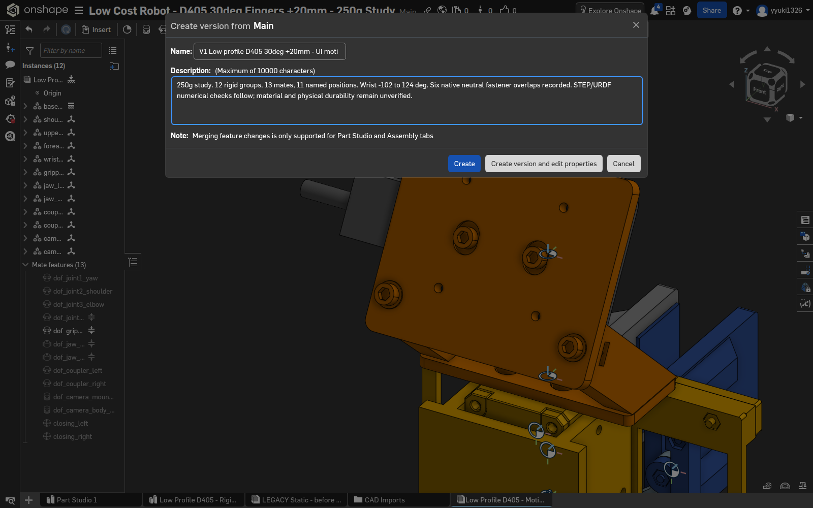

# Onshape UIによるSTEP・URDF出力記録

直接Onshape APIは使用していない。Playwrightで通常画面のExportとブラウザdownloadを操作した。

## 固定版と中立STEP

[V1 Low profile D405 30deg +20mm - UI motion checked](https://cad.onshape.com/documents/29e8557c76e89bcf64f50566/v/4577cc931e9bc290e2b31032/e/d5415bf725ba822741b01703) は、左端 **Create version…** から作成した。Name/Descriptionを入力しCreate。Versions and historyの版名をダブルクリックして、URLの `/v/4577cc931e9bc290e2b31032/` を確認した。

Assemblyタブ **Low Profile D405 - Motion and URDF** を右クリック > **Export…**。中立STEPは次の設定でダウンロードした。

|項目|設定|
|---|---|
|Format|STEP|
|Preprocessing|None|
|Export models oriented Y axis up|チェックなし|
|Use latest version|チェックを外しAP242を明示指定|
|Use custom units for export|チェックしMillimeter|
|Options|Download|
|Export unique parts as individual files|チェックなし|
|Include hidden instances in export|チェックあり|

修復前V1の実ファイルは `CAD/native-poses/diagnostics/v1-pad-misassigned/zero.step`。SHA256 `4a49d515746987cd35773bf8649ccb0cd95e23357b3afb85ec09dd72641629a5`。10,592,591 bytes。OCCT/XCAFで262部品（207 solids、55 sheets）とmm単位を確認。Compositeの階層は展開されるが、各部品名と配置行列は残った。12剛体は部品名の対応表で再構成し、各部品が同じ剛体運動をするかを姿勢ファイルで確認する。

## 保存版での姿勢変更と出力の違い

**失敗例:** 読取り専用版のNamed positionsでyaw 10°を適用すると画面は動いたが、STEP出力は版に保存された中立だった。全STEP DATAが中立ファイルと同一で、bbox差も0。出力成功通知だけでは姿勢一致を保証しない。

このファイルは `CAD/native-poses/diagnostics/version-yaw10-exported-zero.step` に残し、正しいyawの証拠から除外した。

**確認できた経路:** 画面上部 **Return to Main** でWorkspaceへ戻る。Named positionsを開き、中立を適用してから目的の行を右クリック > Apply named position。成功表示と描画を待ってAssemblyタブのExportを実行する。Mainのyaw 10°STEPでは基部が単位行列、上側が世界Z軸−10°となり、実姿勢が出力された。

最初の11姿勢ではPG3_pad_L/Rが期待と反対側のjawに追従し、gripper_openで32.907961 mmのグループ内配置差を検出した。左右Compositeの12部品をUIで再指定し、11姿勢を全件取り直した。修復後は各262部品/207 solids/55 sheets、グループ内の回転・並進行列差0、形状ローカルbboxも中立に対して差0。5能動関節を逆算した角度の最大誤差は0.000003058°（gripper_closed）だった。132配置をm単位で `reports/native-pose-transforms.json` に保存した。修復前の11ファイルは `CAD/native-poses/diagnostics/v1-pad-misassigned/` に保持し、不採用を明示した。ファイル別のURL/設定/SHAは `reports/ui-export-manifest.json`。新規URDF/FK照合は後続の変換器検証で行う。

## 修復後V2

[V2 Low profile D405 - corrected jaw pads](https://cad.onshape.com/documents/29e8557c76e89bcf64f50566/v/f6162b4adc88af9d07f1194a/e/d5415bf725ba822741b01703) を中立復帰後に作成した。以後の変換器入力はこの固定版から保存する `CAD/final-version.step`。11姿勢は直前の同じ修復済みWorkspaceから出力し、固定版中立との配置・形状照合を別に記録する。

V2実ファイルSHA256は `9f58c947753e9229b30939da23ce4c87c1cc85eeb39372518de4ffb98991b93f`、10,592,665 bytes。中立復帰STEPとDATA部分が完全一致した（DATA SHA256 `e5f7a1d5f53831af6e4ce957bde77eb5d058a2d1f00506a42876d701908a5420`）。XCAFでも262部品/207 solids/55 sheets/mmを確認。出力helperの拡張子連結に対する置換ミスで一度Main zeroの保存先へ書かれたため、V2を専用名へ移し、Main zeroはSHAが元の記録と一致するブラウザdownloadキャッシュから復元した。manifestも実保存先へ訂正した。

## 標準UI URDF

2026-09-26のFreeアカウントのAssembly ExportにURDF形式が存在し、実際にダウンロードできた。[公式Exporting Files](https://cad.onshape.com/help/Content/File/exporting_files.htm)にも記載されている。ユーザー指定のPixi/OCCT変換器とは別に比較用として保存した。

設定: Geometry format STL、STL Format Binary、Resolution Fine、Include hidden instancesチェック、Download。固定版V1から取得した `robot/onshape-native/low-profile-onshape-native.zip` は19 links / 18 joints / 261 STL、261 visuals、collision要素0、inertial要素14。

STEPのクランク群13部品に対してURDFの対応リンクvisualは12。`PG3_horn_bolt_1` のvisual参照がない。閉路用の補助リンクが生成されるが、XML直下はlink/jointのみで、全域の閉路動作は未検証。出力されたinertial値にも実材料・実質量の根拠を与えていないため、実物動力学の検証済み値として扱わない。このZIPを最終の検証済みURDFとは位置付けない。

## 形状の読取り上の注意

採用CADと中立UI STEPは全名称/solid-sheet数が一致し、部品ごとのbbox最大差は1.23e-6 mm。既定の体積積分には既存肩部品で5.574 mm³の差があり、高精度積分でも値の差が残る。7部品の追加診断では、今回変更した台座・カメラキャリア・左右爪のメッシュサンプル距離は最大1.63e-9 mm。一方、既存の複雑な3部品はメッシュ化の報告deflection自体が指定値より大きく、最大サンプル距離0.03755 mmだった。

`reports/native-zero-source-comparison.json` と `reports/native-step-geometry-diagnostic.json` にraw値と比較範囲を残した。全BRepの厳密同一性や、既存形状の全不良解消とは主張しない。ローカル採用CADに対する設計変更マスク・干渉検証の結果とは区別する。
