# D405を低くする設計と検証

**Onshape Free / Public → STEP → Pixi / OCCT 8.0.1 → URDF**

2026年9月26日・操作と検証の実記録。対象は俯角30°、爪+20 mmの改善版です。前の75°候補と同じものではありません。

開くモデルは [V2 Low profile D405 - corrected jaw pads](https://cad.onshape.com/documents/29e8557c76e89bcf64f50566/v/f6162b4adc88af9d07f1194a/e/d5415bf725ba822741b01703)。左右パッドの所属を直した版です。V1は失敗解析用に残しています。

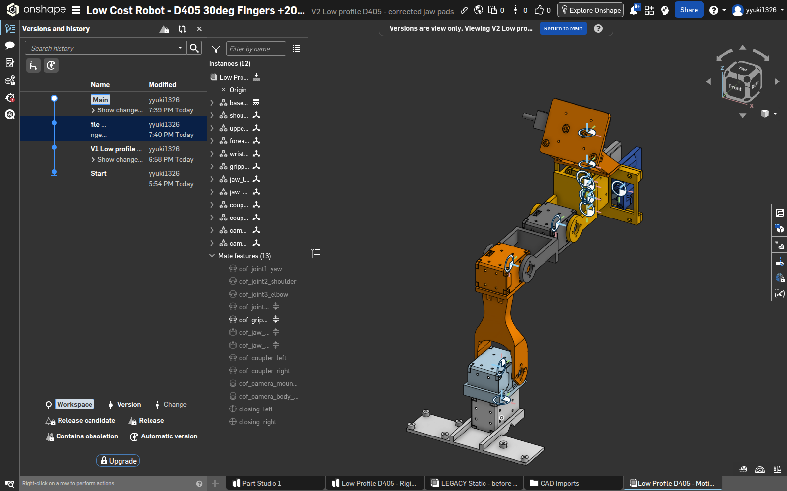

この手順書では、画面の操作箇所・入力・確認・失敗時の戻り方を示します。画像クリックで拡大できるHTML版も用意しました。数値の詳細は [REPORT.md](REPORT.md)、全履歴は [WORKDOC.md](WORKDOC.md)。強度や実機耐久性を保証した製作図ではありません。

---

## 1. 変更内容と選んだ理由

参考SO101グリッパのD405ホルダーは約30°でした。旧75°に比べ浅く取り付けるため、爪を20 mm延長し、ガラス中心をY185/Z250からY165/Z235 mmへ移しました。X=-0.2 mmは同じです。角度は指の前進+Yから下向きに測ります。

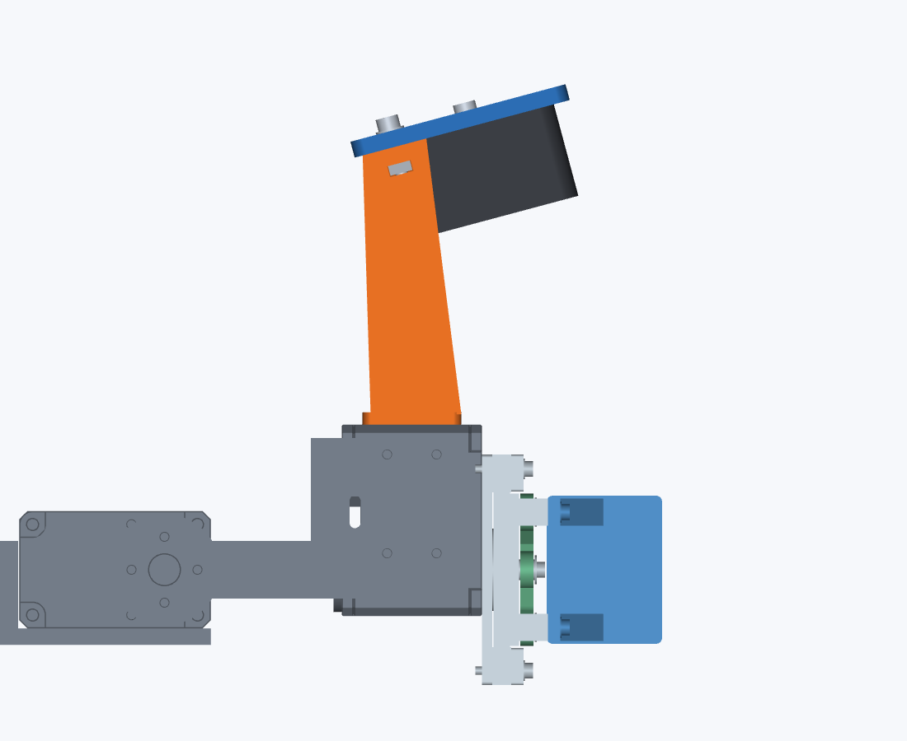

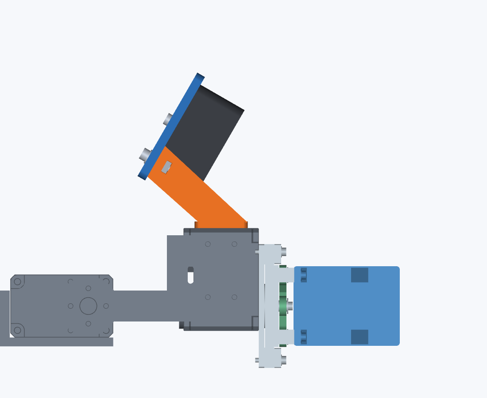

カメラ高さは12.40 mm下がりました。一方、250 gの物体が手首から遠ざかるため、比較対象部分の手首モーメントは0.3504→0.3835 N·m、**9.45%増**です。浅さ・低さと負荷には交換条件があります。5,040候補を比較した範囲での採用で、全条件の最適解ではありません。

---

## 2. 作業文書を分ける

1. 既存compact文書を開き、左上の文書名横メニューから **Copy workspace** を選びます。
2. 名前を `Low Cost Robot - D405 30deg Fingers +20mm - 250g Study` にし、**Create public document** を実行しました。
3. 新文書のURLのdocument IDが `29e8557c76e89bcf64f50566` に変わったことを確認しました。旧文書は保持しています。

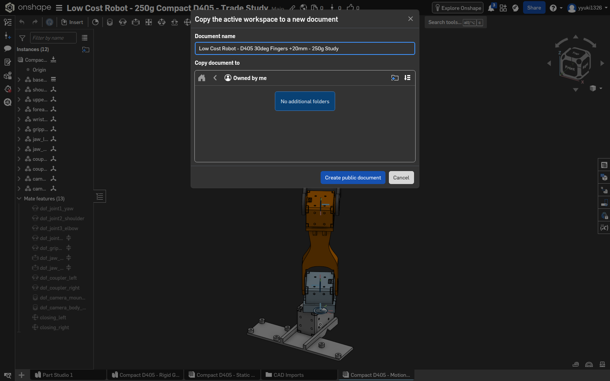

今回の改善は既存の関節構造をコピーして更新する方法です。ゼロからの再構築とは区別してください。初回の独立再構築の手順は [以前のマニュアル](https://github.com/yuki-inaho/3d-printed-dynamixel-gripper/blob/codex/onshape-low-profile-d405/studies/onshape-20260926/outputs/manual/MANUAL.md) にあります。今回を追試するときも、自分のコピーで操作し、保存済みV2を基準に比較します。

---

## 3. STEPを画面から更新する

1. 下部のRigid Groups用Part Studioを開きます。
2. 左のfeature一覧で **Import 1を右クリック → Update**。ローカルの `CAD/Robot_250g_low_profile_D405.step` を選びます。
3. import完了通知を待ち、カメラの低配置と長くなった爪を見ます。通知だけで下流の所属修復まで成功したと判断しません。
4. タブ名を `Low Profile D405 - Rigid Groups` とし、旧Staticタブは `LEGACY - Static before ...` と区別しました。

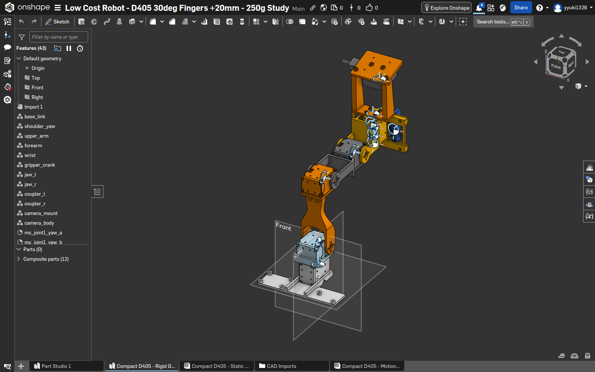

今回、移動したカメラ部品の所属が外れました。画面下部の **Parts** と **Composite parts** の数を確認し、次ページの修復を行います。新規取込の場合は左下＋からImportですが、今回実行した経路はImport featureのUpdateです。

---

## 4. カメラ部品の所属を直す

1. 左のfeature一覧で `camera_body` をダブルクリックします。
2. 選択欄の誤った項目を×で外し、部品名から **CAM5_D405_BODY、CAM5_D405_USB_PLUG、CAM5_D405_USB_CABLE_STUB** の3件を選びます。チェックマークで確定します。
3. `camera_mount` も編集し、台座・キャリア・締結部品の18件を所属させます。全名称は [expected-groups.json](reports/expected-groups.json) の該当群です。
4. 各編集のタイトルが目的の群名であること、選択後に名称が欄へ入ること、確定後の再表示を確認します。

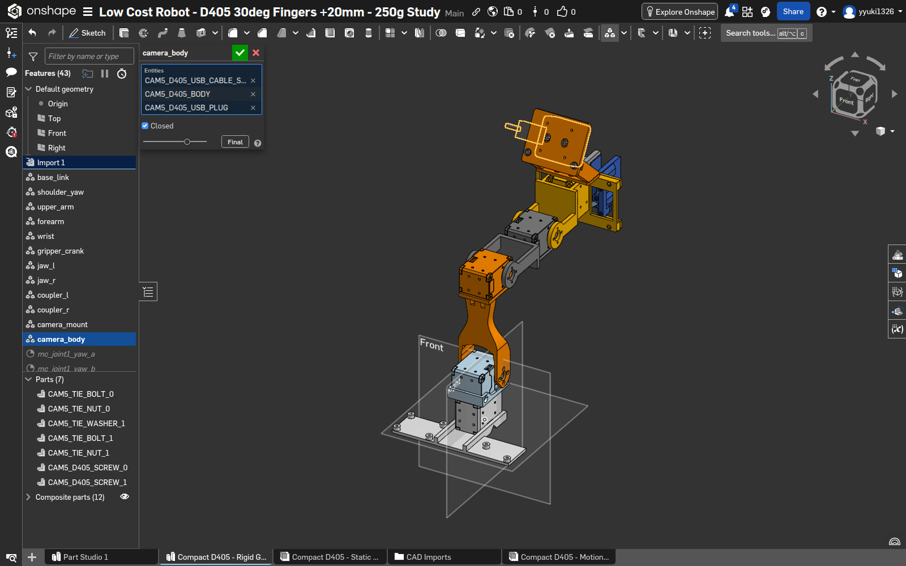

最終的にParts 0、Composite parts 12。ただし、この数だけで左右の取り違えまでは検出できません。次の修復が必要でした。

---

## 5. 同じ形の左右パッドに注意する

中立では正常に見えても、V1は `PG3_pad_L` が右jaw、`PG3_pad_R` が左jawへ追従していました。開いたときの同一群内の移動差32.908 mmで判明しました。

1. `jaw_l` をダブルクリックし、旧unionの選択項目を×で削除します。
2. [expected-groups.json](reports/expected-groups.json) のjaw_lに列挙した12部品を、**L側の名前を確認して**選び直します。緑のチェックで確定します。
3. 同じ操作をjaw_rの12部品にも行います。左だけを直した途中で右側が重複エラーになっても、両側を修復するまで評価を終えません。
4. 開・閉でパッドがそれぞれ自分の爪についてくることを見て、STEPでも全構成部品の配置を比較します。

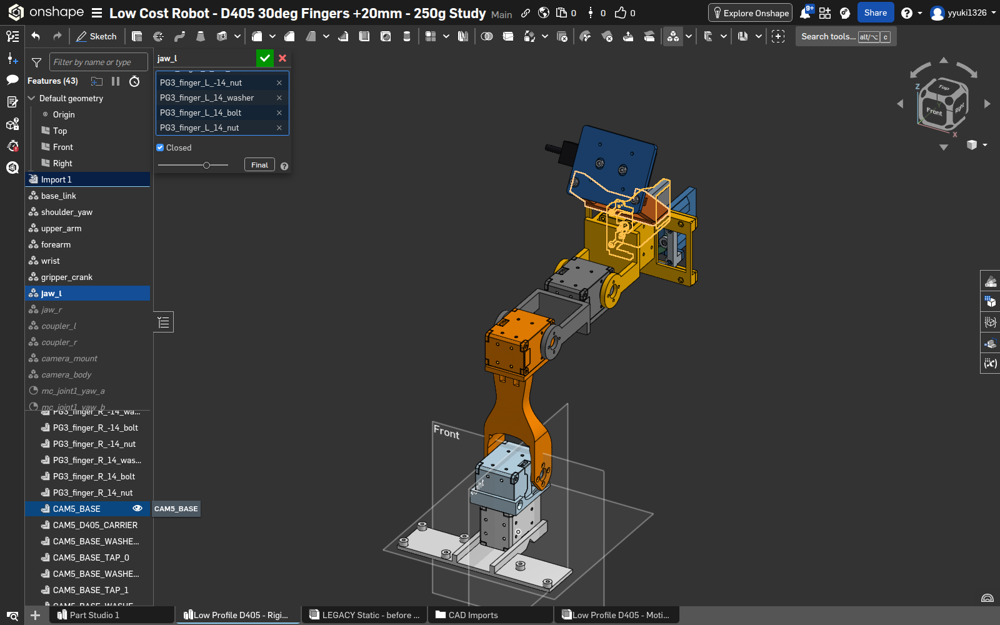

画像は選択編集中です。確定後の成功根拠はParts 0/Composite 12と、修復後11姿勢×左右2群の行列一致です。旧失敗STEPも診断用に保存しました。

---

## 6. Mate connectorと手首範囲を更新する

1. Part Studioのカメラ固定用Mate connectorを開き、親/子側ともオフセットの **X=-0.2、Y=165、Z=235 mm** を設定しました。ownerが意図したCompositeであることも確認します。
2. 下部 `Low Profile D405 - Motion and URDF` を開き、12 instances / 13 mates、base_linkだけ固定されていることを確認します。
3. `dof_joint4_wrist` を編集し、Z角度のLimitsを **Min=-102°、Max=124°** にします。確定後に開き直して値を再確認します。

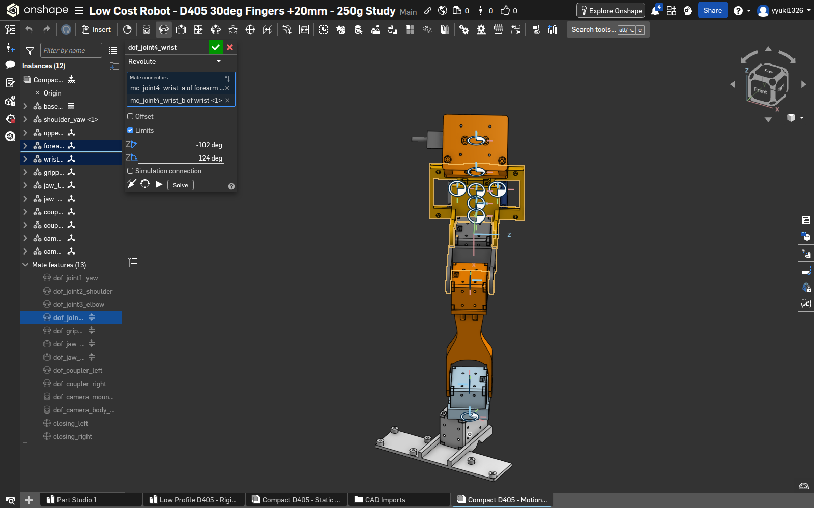

物理CAD角は符号が反対で-124〜+102°です。以前より合計18°狭くなりました。境界の次の2°サンプルでは隙間不足・材料交差があり、無理に旧範囲を残しません。既存の13mateの位置と種類は [joint-definitions.json](robot/joint-definitions.json) に記録しています。

---

## 7. Named positionsへ5軸を登録する

1. Assembly右側の **Named positions** パネルを開き、**Add named position** を選びます。
2. Driving mate selectorで yaw、shoulder、elbow、wrist、gripper の各mateを選び、**Z rotation** を有効にします。
3. 5列の角度セルをダブルクリックして入力します。入力欄だけで反応しないときは、セル全体をダブルクリックします。
4. 行名を `zero` とし全5値を0°にします。名前セルを右クリックして **Apply named position**。

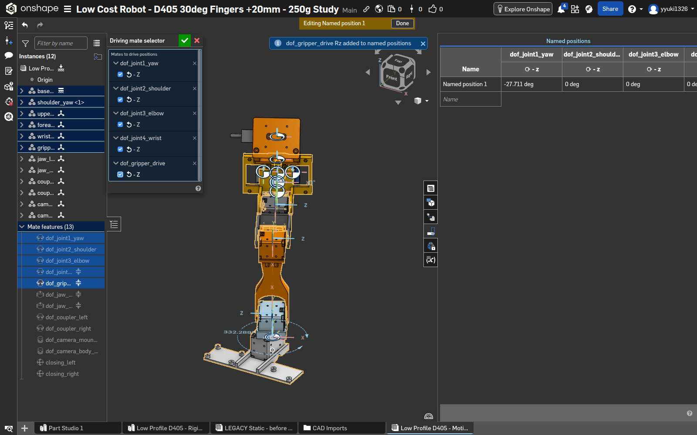

名前の保存と角度の編集を連打すると旧値へ戻る例がありました。編集後に値を読み直してから次へ進みます。現在姿勢と同じ行ではApplyが表示されない場合があります。入力値・Apply成功表示・実モデル配置を別々に確認します。

---

## 8. 11姿勢を確認し、失敗を扱う

|姿勢|指定する軸と角度|他の4軸|
|---|---|---|
|zero / restored_mid|全軸0°|0°|
|small_joint1〜4 / small_gripper_drive|それぞれ+10°|0°|
|wrist_lower / wrist_upper|wrist -102° / +124°|0°|
|gripper_open / gripper_closed|gripper +65° / -45°|0°|

肩10°への一括適用はsolverエラーになったため、0→10°を1°刻みで適用しました。手首上限ではmateを右クリック → **Apply limit position → Max Z angle limit** が有効でした。ただし他軸が動くことがあります。

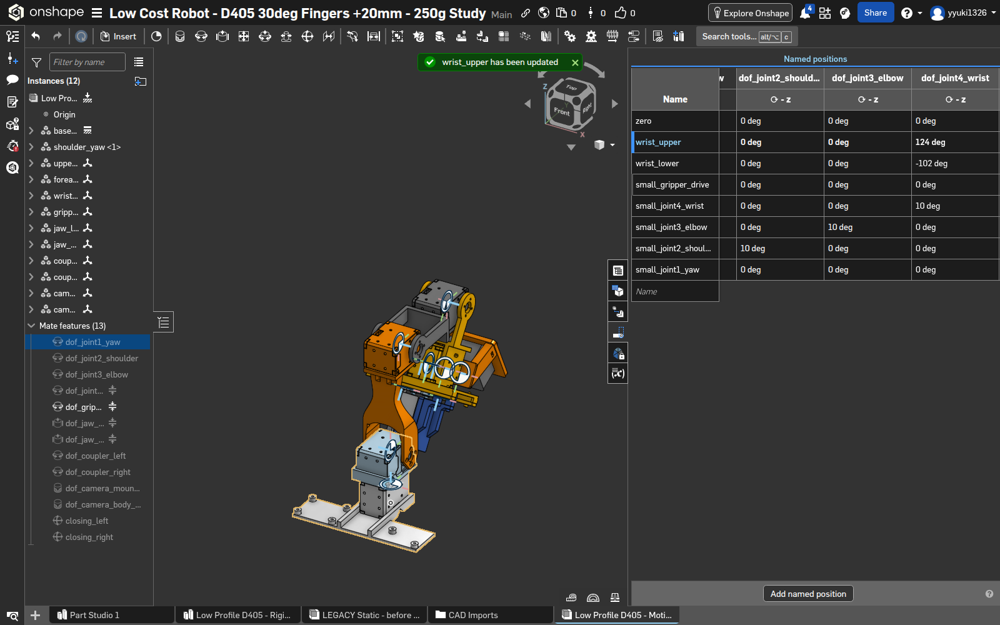

**Update named position** で実到達状態を取り込み、5値を見直します。今回、gripperが-19.022°へ動いていたため0°へ修正して再適用しました。閉側もMin limit経由で復旧。最後はzeroへ戻します。

---

## 9. Animateで動作を見る

1. Assembly左のmate `dof_joint2_shoulder` を右クリックし **Animate** を開きます。
2. Start=0°、End=10°、Steps=101、Singleで実行しました。
3. **Current value** が3.465→6.733→10°へ進むことと、solverエラーがないことを確認しました。headlessでは数分かかりました。
4. 手首もStart=0°、End=124°、Steps=25で終点へ到達しました。

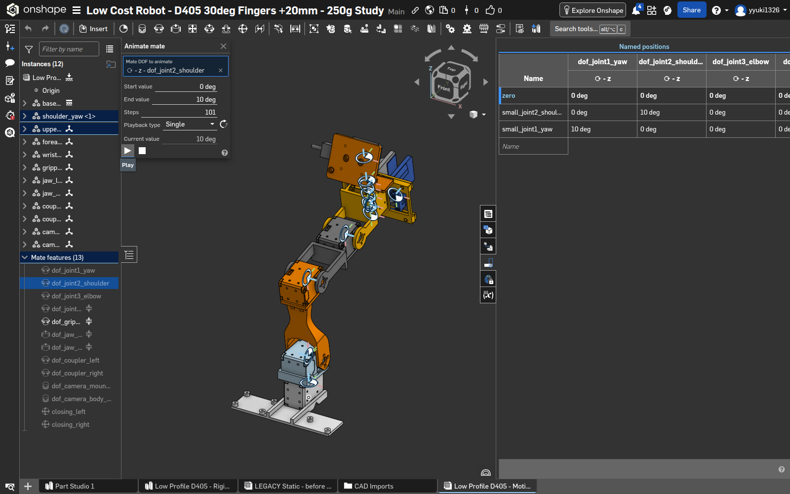

**Animateを閉じると元の姿勢へ戻りました。** 終点の表示を保存姿勢の証拠にせず、Named positionsで別に適用・保存します。Mate編集ダイアログの単体プレビューではなく、Assemblyのcontext menuから機構全体のAnimateを使います。

---

## 10. Interference detectionを使う

1. 中立へ戻し、右下の **Analysis → Interference detection…** を開きます。
2. Instancesのbase_linkからcamera_bodyまでShift選択し、ダイアログに**12名称**が並ぶことを確認します。
3. Include standard content / Show top level onlyは未チェック。結果を1件ずつ選んで、赤いハイライトの位置を確認します。

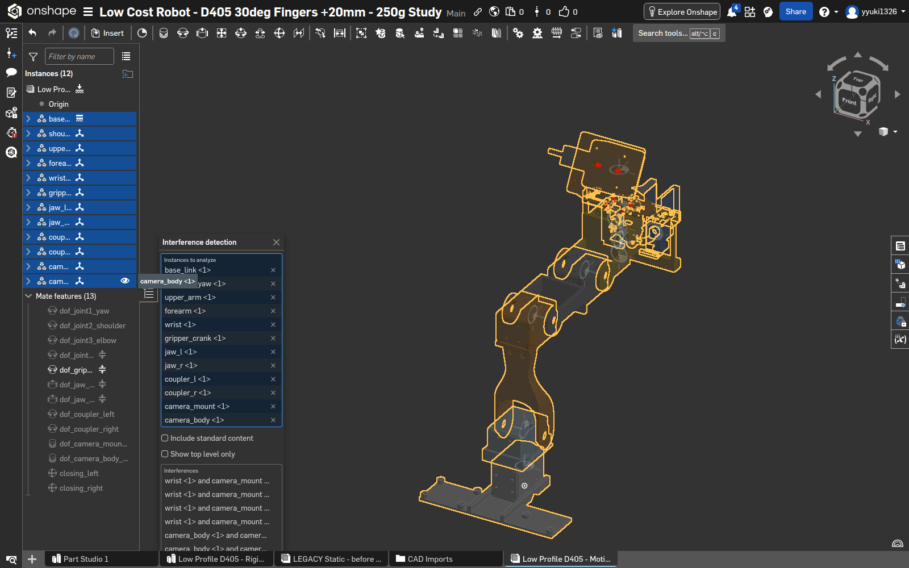

結果は6件。wrist/camera_mountが4件、camera_body/camera_mountが2件で、台座ねじ4本とD405ねじ2本の係合位置でした。表示の0.003 m×0.003 m×0.003 mは丸めたbox寸法で、交差体積ではありません。ゼロ件にするためにねじを削除しません。これは中立の群間検査で、Composite内部や全動作は別のローカルCAD検査で扱います。

---

## 11. 修正版をVersionに保存する

1. 11姿勢検証後、全5軸0°の中立へ戻します。
2. 左の **Versions and history → Create version…** を開きます。
3. Name=`V2 Low profile D405 - corrected jaw pads`。Descriptionにはパッド修復と検証範囲を記載し、Createを押します。
4. 一覧の版名をダブルクリックし、URLが `/w/…` から `/v/f6162b4adc88af9d07f1194a/…` へ変わることを確認します。

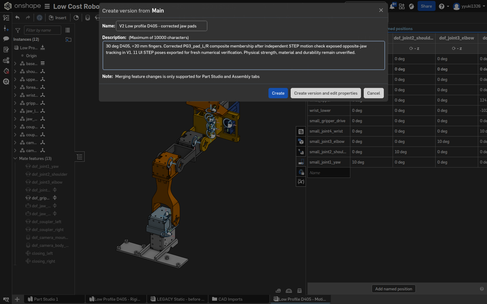

読み込み中のスクリーンショットは完成証拠にしません。版名・モデル・部品数が表示されるまで待ちます。既存V1は失敗解析用に残しました。新しい設計を作る場合はMainまたは自分のコピーで編集し、比較時には固定版を指定してください。

---

## 12. STEPをUIでダウンロードする

1. 下部のMotion Assemblyタブを右クリックし **Export…**。
2. Format=**STEP**、AP242、Units=**Millimeter**、preprocessing=**None**。
3. Y-axis upはOFF、個別ファイル化はOFF、hidden instancesを含める設定はON。Downloadで保存します。
4. V2の中立出力を `CAD/final-version.step` としました。262 occurrence / 207 solids / 55 sheets、SHA256先頭 `9f58c947` を照合しています。

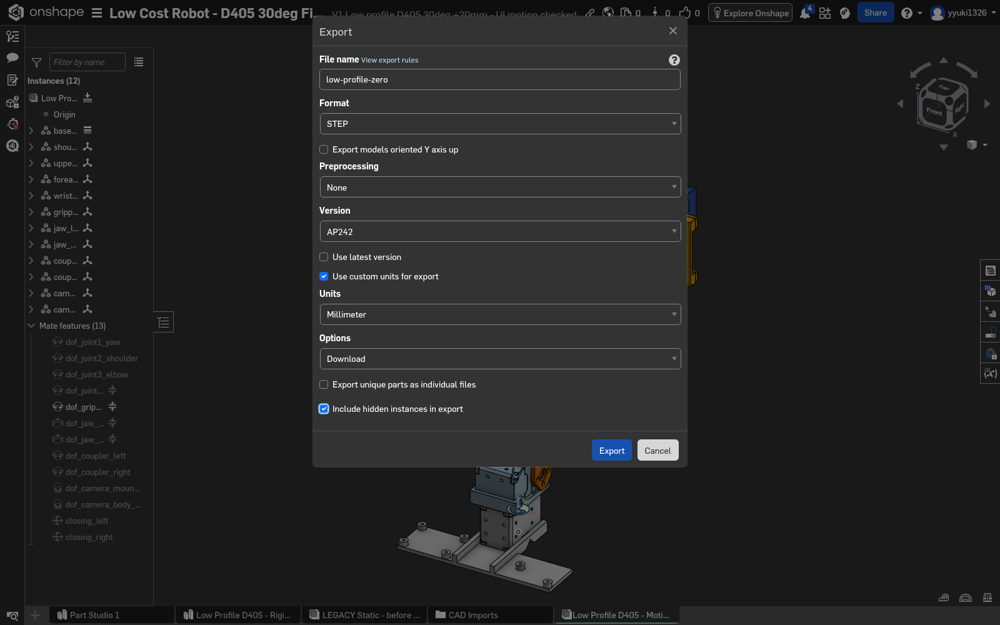

今回の解析はZ上、mmのSTEPからmへ一度だけ変換します。単位を画面の見た目で推定せず、出力ファイルの単位と外形も確認します。形状修復や許容値の緩和は行っていません。

---

## 13. 姿勢ごとのSTEPはMainから出す

読み取り専用Versionでyaw10°を表示して出力したところ、STEPは保存済みの中立でした。**画面が動いたことと、出力形状が動いたことは同じではありません。**

1. **Return to Main** でworkspaceへ戻ります。
2. Named positionsのzeroを適用し、続いて対象姿勢を適用します。5値・エラー・モデルを確認します。
3. 前ページの設定でSTEPを保存します。11姿勢は `CAD/native-poses/` にあります。
4. 各群の全構成部品の行列が一致すること、対象軸が指定角へ動いたことをローカルで確認します。

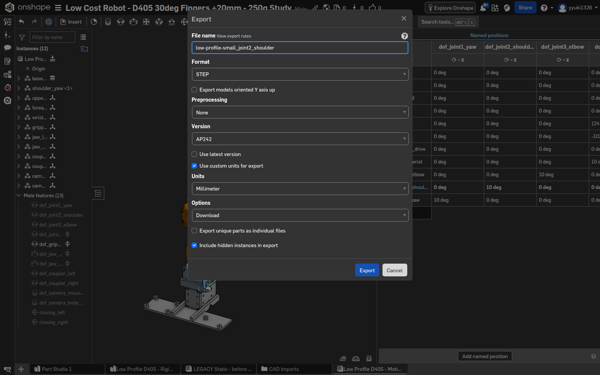

修復後は11×12群の内部配置差0、能動角の最大差3.058e-6°。旧V1の失敗ファイルはdiagnosticsへ残しました。出力ファイル名の誤指定は、ダウンロードキャッシュから元zeroをSHA確認して復元しました。

---

## 14. 標準UIにもURDF出力がある

Assemblyタブ右クリック → Export… → Format=**URDF**。今回のFree画面で選択できました。Geometry format=STL、Binary、Fineを指定しZIPをダウンロードしました。

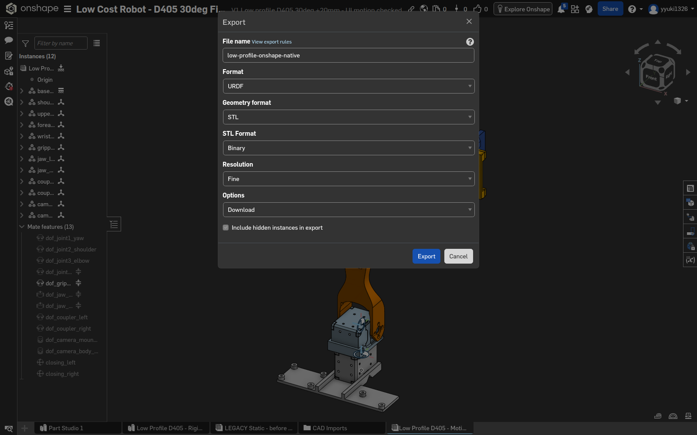

この参考ZIPは修復前V1です。19links/18joints/261visualsで、PG3_horn_bolt_1のvisualが欠落、collisionは0、閉路もそのまま使えると確認できていません。`robot/onshape-native`へ区別して保存しました。

**今回使う最終モデルは次ページの指定変換器から生成した `robot/model/robot.urdf` です。** UIにURDFがあるという事実と、その出力が目的のロボットモデルとして正しいことは別々に検証します。どちらの出力も直接APIは使っていません。

---

## 15. PixiでSTEP→URDFを実行する

変換器は [yuki-inaho/urdf_from_step](https://github.com/yuki-inaho/urdf_from_step/tree/codex/pixi-occt8) の `codex/pixi-occt8`。Linux x86-64、Python3.12.14、pythonocc/OCCT8.0.1をlockしました。OCCTはconda-forge配布バイナリ、wheelは変換器自身のビルドです。

```sh
cd work/urdf_from_step
pixi install --locked
pixi run versions
pixi run test
pixi run build
pixi run convert ../../outputs/low-profile-250g/CAD/final-version.step \
  --config ../../outputs/low-profile-250g/robot/converter-config.json \
  --output temp/low-profile-robot-recheck
```

開始ディレクトリは本作業場のルートです。pixiがPATHになければ `pixi` を使います。別の場所へcloneする場合はSTEP/設定の絶対パスを渡してください。出力先は新規または空にします。既存結果を暗黙に削除しません。

STEPだけでは関節の意味を決められないため、UIで決めた軸・位置・limitsと12群の所属をJSONで指定します。CADのmmをmへ変換し、各linkの座標系とメッシュ配置を明記します。詳細契約は [CONVERTER.md](CONVERTER.md)。

---

## 16. URDFを数値で検証する

変換器ディレクトリから実行します。最初のコマンドは保存済み `robot/model` と11姿勢STEPの解析記録を照合します。

```sh
pixi run python ../../outputs/low-profile-250g/robot/validate_robot.py
pixi run pytest -q ../../outputs/low-profile-250g/robot/test_validation.py
```

|確認|結果|判定基準|
|---|---:|---|
|部品/メッシュ|262件 / 12個|全所属、一意、同名反復を保持|
|リンク/関節|16 / 15|5能動・4受動・6固定|
|閉路441姿勢|最大3.47e-17 m|1e-6 m未満|
|native 11姿勢・並進|最大8.78e-9 m|2e-5 m未満|
|native 11姿勢・回転|最大5.34e-8 rad|2e-5 rad未満|
|負の対照|4試験PASS|旧pad誤所属、軸逆、単位誤りを拒否|

グリッパの受動関節は `pg3_states.py` で計算します。theta25°=開48.90 mm、90°=中立15.99 mm、135°=閉0.927 mm。通常の線形mimicだけでは表現できません。

数値差が微小でも、実機のnm精度を意味しません。effort/velocity=0は未設定、inertial未校正、camera_bodyは校正済みoptical frameではありません。運動学の検証と制御・動力学の承認を分けます。

---

## 17. 対象物が両眼から見えるか

採用モデルの両眼、10/20/30 mm立方体、実マウント・アーム・ケーブルを含む描画で検査しました。最小可視率93.28%、最短軸方向距離78.68 mm。848×480の75 mm条件はPASS、720pの100 mm条件はFAILです。

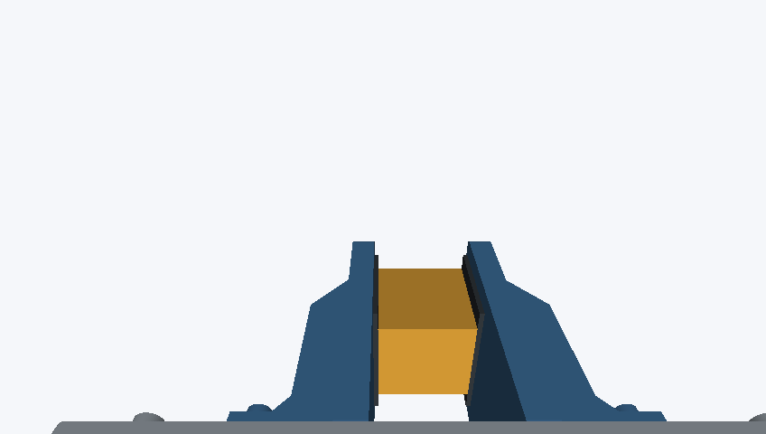

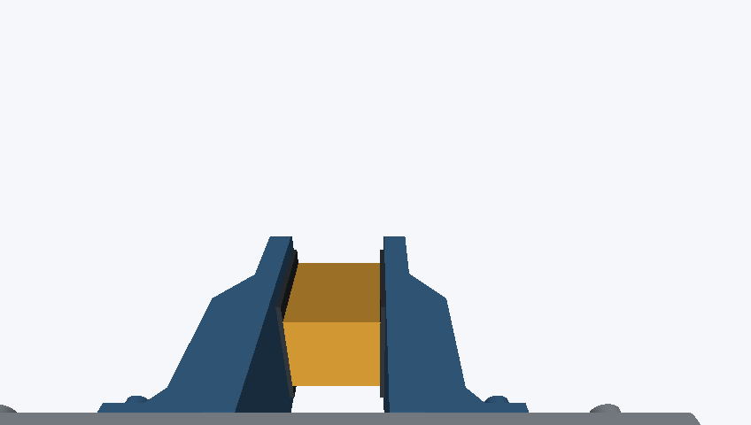

これはCADからの光線評価で、実写ではありません。反射、照明、模様、深度ノイズ、外部校正は未確認。250 gの物体がこの立方体サイズという意味でもありません。ハンド全体の収まりを必須にせず、対象物の両眼可視性を優先しました。

---

## 18. 組立順と耐久性の未確認項目

1. 延長爪の根元4本を元の位置で固定します。
2. **カメラを付ける前に**台座をID5上面へ4本で固定します。
3. 作業台上でD405とキャリアをM3x6の2本で組みます。今回の挿入は3 mm、仕様最大4 mmに対して1 mm余裕。
4. カメラ付きキャリアを台座へ載せ、tie bolt2本で固定します。台座の整備時は先にキャリアを外します。

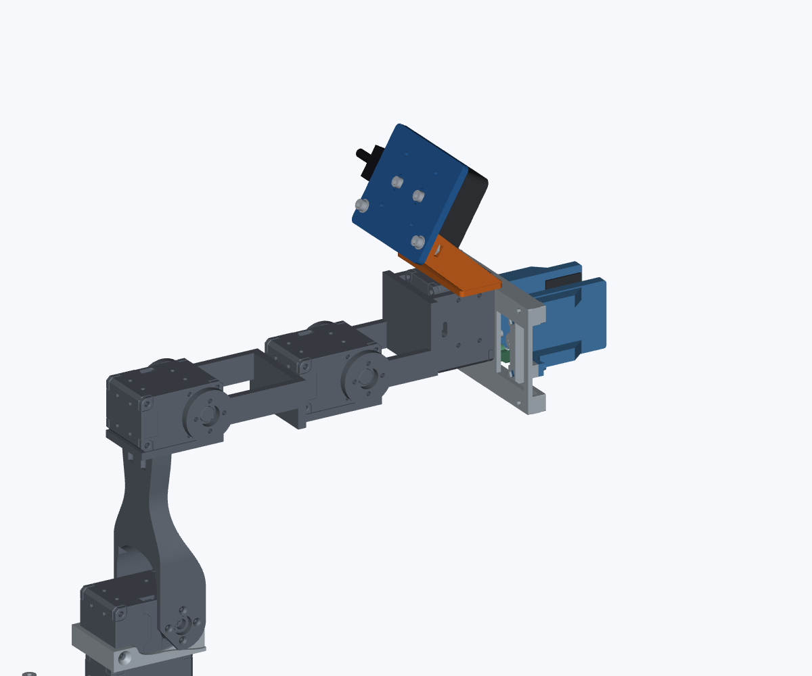

完成状態では台座4本に工具が当たり、アクセス検査はFAILでした。順序を分けた12本の工具包絡検査はPASS。工具の寸法仮定と除外部品は [SERVICE.md](SERVICE.md) にあります。ビット係合、ナット保持、締付トルク、全体挿入経路、自由ケーブル、実物公差は未確認です。

爪延長は荷重レバーを増やします。材料・造形方向・摩擦・連続トルクを決め、実荷重と繰返し試験で次に評価する必要があります。今回の作業は印刷・通電・購入を行っていません。

---

## 19. APIを節約する運用と今回の教訓

|目的|今回の経路|習得した注意点|
|---|---|---|
|作成/取込/修復|通常UI + headless Playwright|編集タイトルと選択名を毎回確認|
|姿勢/Animate/干渉|通常UI|全5軸、対象12群、終点と保存を区別|
|版/STEP/参考URDF|通常UI|Versionの表示姿勢とexportは別|
|正確な部品配置|UI STEP + XCAF解析|代表1部品だけで群全体を判断しない|
|探索/閉路/URDF|ローカルCADとPixi|認証なしで保存入力から再試験|

今回の低配置工程は **直接Onshape API 0件**、例外なし。旧ローカルカウンタは526のままです。アカウント年次残量を意味しません。APIしか使えないと確定した工程はありませんでした。

Playwrightでは同じ画面を変更する処理を並列実行せず、前の処理の終了→DOM取得→一意な対象操作→保存後の再確認の順にします。profileと認証stateはprivate領域に置き、Gitへ含めません。STEP、画像、定義、ハッシュをキャッシュし、検証のたびにOnshapeへ取り直しに行きません。

公式資料: [Import Update](https://cad.onshape.com/help/Content/Document/working_with_imported_cad.htm) / [Named positions](https://cad.onshape.com/help/Content/Assembly/named_positions.htm) / [Mates](https://cad.onshape.com/help/Content/Assembly/mates.htm) / [Interference](https://cad.onshape.com/help/Content/View/interference_detection.htm) / [Export](https://cad.onshape.com/help/Content/File/exporting_files.htm)。実行証跡は [API-USAGE.md](API-USAGE.md)、[EXPORT.md](EXPORT.md)、[NATIVE-VALIDATION.md](NATIVE-VALIDATION.md) にまとめています。
