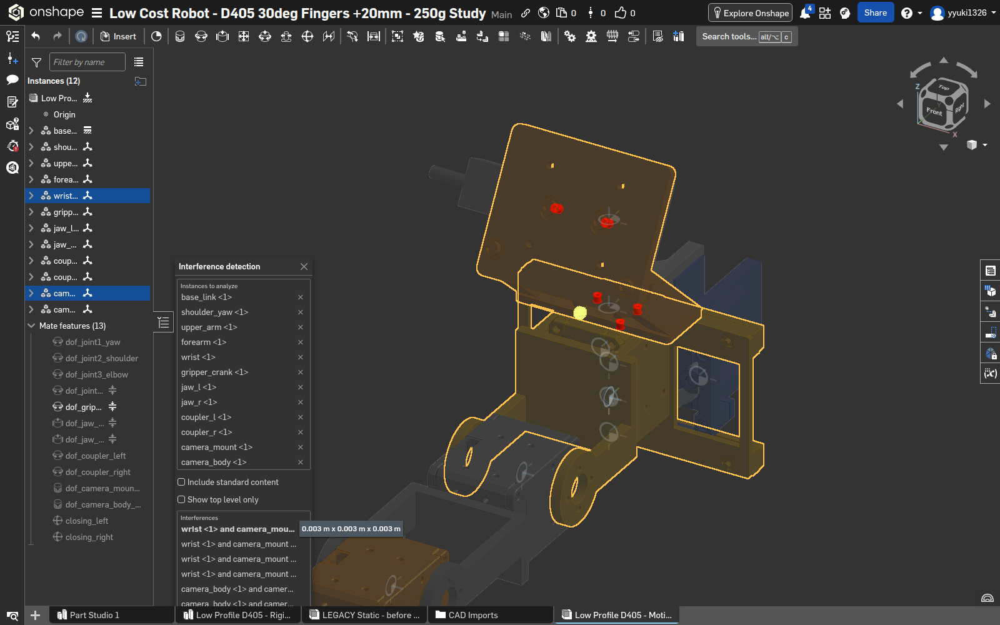
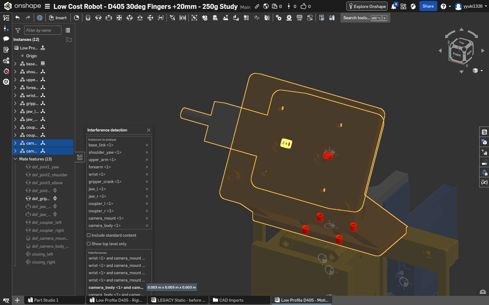
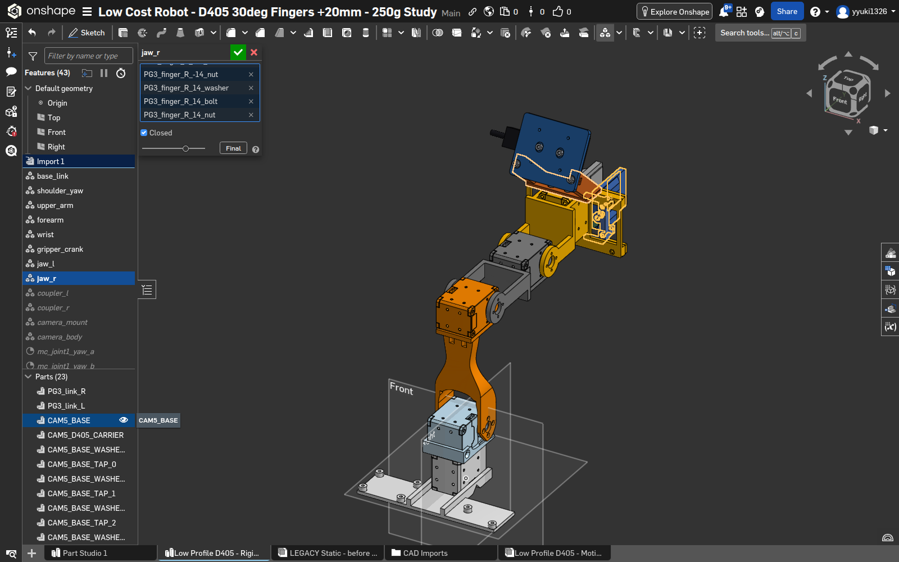
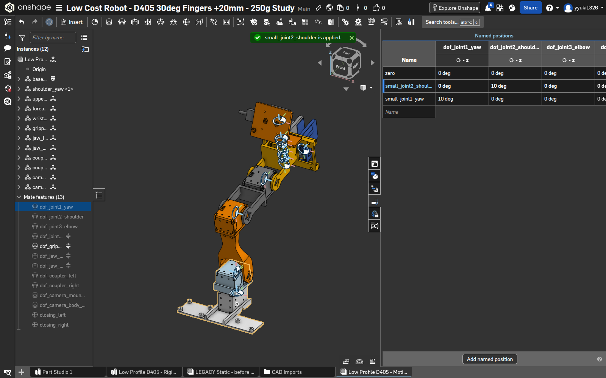
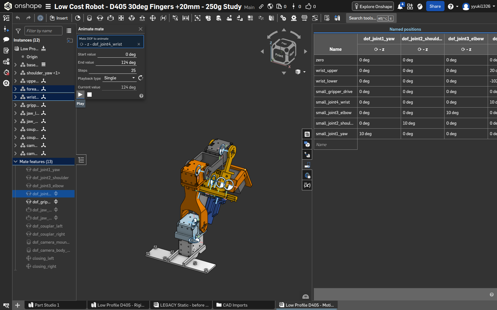

# Onshape ネイティブ検証記録

対象は新しい [Low Profile D405 - Motion and URDF](https://cad.onshape.com/documents/29e8557c76e89bcf64f50566/w/6bce790334ee57d808213530/e/d5415bf725ba822741b01703)。旧 compact 文書の検証結果は新形状の証拠として転用しない。

## 検証の段階

1. Import更新後のグループ参照を修復し、未所属Parts 0 / Composite 12、Assembly 12 instances / 13 matesを確認。
2. Named positions に5能動関節のZ回転列を登録。数値入力→保存値再読取→Apply結果→画面保存で11姿勢を確認済み。結果は `reports/native-ui-poses.json`、期待値は別の `reports/native-pose-targets.json`。
3. UIから出力した11姿勢のSTEPを読み、12剛体×11姿勢の実配置を取得済み。5能動関節の角度逆算は指定値との差が最大0.000003058°。V1で左右padが反対jawへ追従する不一致を検出し、左右それぞれ12部品の選択をUIで再構築した。修復後の11姿勢を全件再出力し、全グループ内の回転・並進行列差が0であることを確認した。`reports/native-pose-transforms.json`、`reports/pad-membership-repair.json` を参照。新規URDFとのFK照合は変換器検証で実施する。
4. 全12 instancesを指定したInterference detectionを中立姿勢で実施済み。6件の表示を個別選択し画像保存。Composite内部の部品間は別途ローカルCAD検査で扱う。

11姿勢は、中立、yaw/shoulder/elbow/wrist/gripper各+10°、wrist −102°/+124°、gripper +65°/−45°、中立復帰。全5能動軸を指定し、動かさない軸は0°とした。最終4ケースではUpdateによる実姿勢の再捕捉も行い、5値一致を確認した。初期7ケースの画面証拠は保存値とApply通知であり、それとは独立に全11件の実配置を輸出STEPから確認した。

## Interference detection

右下Analysis > Interference detection…を開き、Instancesのbase_linkからcamera_bodyまでShift選択。ダイアログに12名称が並ぶことを確認した。Include standard contentとShow top level onlyはいずれも未チェック。今回のねじは取り込まれたCADなので、standard content除外の対象と混同しない。

結果6件: wrist / camera_mountが4件、camera_body / camera_mountが2件。各結果の表示boxは丸められた **0.003 m × 0.003 m × 0.003 m**。体積や精密寸法ではない。個別選択のハイライトは台座固定4本・D405固定2本の食い込み位置に一致した。設計上のねじ係合として記録し、ゼロ件になるよう形状を削除しない。実物のねじ山適合・締付保持力の合格を意味しない。

個別6画像は `images/onshape-interference-mid-0.png` から `-5.png`。中立姿勢のinter-instance検査であり、全動作の連続無干渉やComposite内部の全接触を保証しない。ローカルCADの開閉23姿勢・手首2°刻み検査は `GEOMETRY.md` と別に追跡する。

## 失敗と復旧

左右padの旧union参照はImport Update後に逆jawへ対応していた。中立では正しい外観だったが、gripper_openで同じグループ内の部品行列に32.907961 mmの差が出た。左右のCompositeを編集し旧選択を削除、各12部品を名前で再指定して修復した。左だけを直した途中には右側の旧unionと重複するエラーが出たため、両側を完了するまで成功扱いにしなかった。修復前11 STEPとFAILレポートはdiagnostics/v1-pad-misassignedへ残し、修復後は全11姿勢×左右2群が一致した。固定版は [V2](https://cad.onshape.com/documents/29e8557c76e89bcf64f50566/v/f6162b4adc88af9d07f1194a/e/d5415bf725ba822741b01703)。

肩10°の一括適用は `Mates could not be solved`。1°ずつの補間では0→10°に到達した。手首上限124°の一括適用と10°刻み補間（20°の段階）は失敗。context menuの **Apply limit position → Max Z angle limit** では124°へ移動できたが、Update named positionで捕捉するとグリッパ軸が−19.022°へ漂移していた。表のグリッパ軸を0°へ修正してApplyすると、目的の `[0,0,0,124,0]` を適用できた。さらにUpdateで実到達姿勢を捕捉し、全5値を確認した。最終的な適用成功は輸出STEPによる数値確認とは区別する。

行名変更と角度変更を連続して送ると保存が競合し、入力角度が旧値へ戻る例があった。各編集・適用後に安定待ちを入れ、表示値を再読取してから次の操作へ進める。現在姿勢と同じ行にはApplyが現れない場合もあるため、メニューがないだけで機構故障と判断しない。

## Animate

Mate context menuから `dof_joint2_shoulder` のAnimateを開き、Start 0° / End 10° / Steps 101 / Singleで実行。Current value 3.465°→6.733°→10°と変化し、終点に到達した。閉じると元の姿勢へ戻ったので、終点を保存済み姿勢と扱わない。

手首でもStart 0° / End 124° / Steps 25 / Singleで終点124°へ到達した。Animate中はNamed positionsの更新メニューを使えなかった。保存には上記のApply limit position経路を用いた。

公式の操作説明: [Named positions](https://cad.onshape.com/help/Content/Assembly/named_positions.htm)、[Mates / Animate](https://cad.onshape.com/help/Content/Assembly/mates.htm)。機構全体を解くcontext Animateを使用した。Mate定義ダイアログ内の単独プレビューとは区別する。

ネイティブの動作確認は、実物強度、疲労寿命、ケーブル変形、印刷誤差、接触摩擦の試験ではない。これらの未知をPASSへ変更しない。

## 新規URDFとの最終照合

V2 STEPからPixi/OCCT8.0.1で生成したURDFを全11姿勢に適用し、12剛体の実STEP配置と照合した。最大並進差8.78488e-9 m、最大回転差5.33710e-8 radで基準各2e-5以内。441閉路状態の位置残差は最大3.46945e-17 m。`robot/validation.json` を参照。この微小な数値差は運動学計算の整合性で、製造精度や物理実測精度ではない。旧V1のパッド逆所属を同じ判定器が拒否する負対照も通過した。
