# Onshape ロボット作業マニュアル

## アーム・PG3グリッパ・D405カメラマウント

**取り込み → 組立 → 動作・干渉検証 → URDF → 別プロジェクトで再現**

2026年9月26日作成 ／ Onshape Free ／ 日本語手順・英語UI

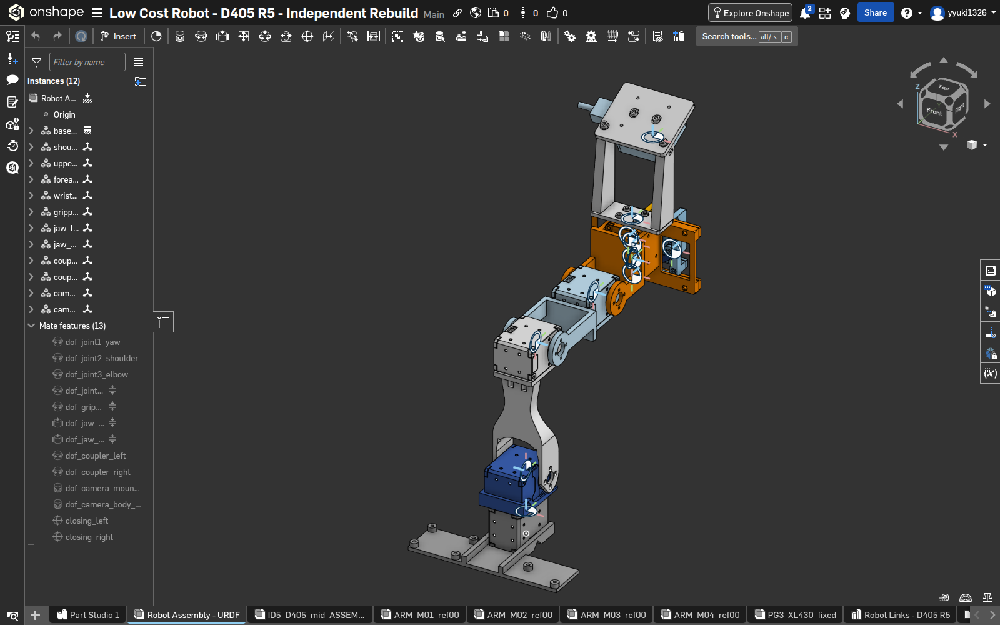

**図01｜完成後に再表示。** 左に12個のInstancesと13個のMate features、中央に統合ロボット、下に各タブがある。

この冊子は、今回実行した手順を人間が追えるようにまとめたものです。クリック操作と、ローカルのPython・APIで実行した処理を明示します。画面だけですべて組み立てたという記録ではありません。

**対象モデル：** XL430アーム＋PG3 ID5単一モーターグリッパ＋D405 R5マウント。寸法・部品分類・関節名はこのモデル専用です。

---

## 01｜まず全体の流れをつかむ

|段階|人が操作する場所|今回の実施方法・完了の目印|
|---|---|---|
|1 原本確認|ローカルのファイル|統合STEPとSHA-256を記録|
|2 新規作成・取込|Onshape Documents／左下＋|公開Documentへ取込、262ボディ|
|3 剛体・関節作成|ローカルPython → Onshape API|12 composite、26 connector、13 Mate|
|4 静止・動作確認|Assemblyの左ツリー|Mate状態と姿勢を確認、Animateが動く|
|5 干渉確認|Assembly右下の解析メニュー|開・中・閉の各姿勢で12個を検査|
|6 版を固定|Versions and history|検証済みVersionを作成|
|7 URDF出力|ローカル端末|onshape-to-robot 1.8.3を実行|
|8 数値検査・再作成|ローカル端末＋別Document|16リンク・15関節、441姿勢を検査|

### 読み方

- **新しく同じものを作る：** 02から順に進む。既存の完成Documentを作成スクリプトの対象にしない。
- **検証操作を練習する：** 09〜16を読む。既存モデルを閲覧し、編集ダイアログは赤い×またはEscで閉じられる。
- **URDFだけ使う：** 18〜20を読む。配布済み `robot/` はすぐに検査できる。

### UIの用語

**Document**＝プロジェクトの入れ物。**Part Studio**＝部品形状とフィーチャー。**Assembly**＝部品の配置・可動関係。**Composite**＝複数のボディを1つの剛体として扱うまとまり。**Mate connector**＝接続位置と向きを示す座標系。**Mate**＝部品間に残す自由度の定義。

本書の「0から再作成」は、**新規Documentへ同じSTEPを再取り込みし、剛体と関節を作り直す**意味です。全形状のスケッチ再設計は行っていません。

---

## 02｜取り込む原本を間違えない

### 操作する場所：ローカルのファイルマネージャー／端末

今回使ったのは次の統合STEPです。アーム・グリッパ・カメラマウントをすべて含みます。

```text
./
outputs/camera-mount-id5-overhead-d405-r5/CAD/
ID5_D405_mid_ASSEMBLY.step
```

上は読みやすく改行した1本のパスです。ファイル名が同じでも、再生成すると中身が変わる場合があります。

```bash
sha256sum ./outputs/camera-mount-id5-overhead-d405-r5/CAD/ID5_D405_mid_ASSEMBLY.step
```

今回のSHA-256：

```text
5a60d93b5feef6957bef5a0a732fd26d3b147f1e7e39917eb87cf5d28943dbf1
```

### 原本で確認したこと

|確認した資料|確認の目的|
|---|---|
|`docs/CAMERA_MOUNT_ID5_D405_R5.md`|D405 R5マウントの構成・既存の干渉診断|
|`docs/PG3_ID5_ONLY_DESIGN.md`|単一モーターのグリッパ構成|
|`references/arm-r3/joints.json`|アーム関節の位置・向き|
|`gripper_design/pg3_id5.py` など|クランク・スライダの幾何関係|

これらは上記グリッパリポジトリ配下です。`low_cost_robot` 内の古いXL330・旧グリッパ用URDFを、そのまま今回のXL430モデルへ流用していません。

**正常の目印：** Onshape取り込み前の原本は257 occurrence。取り込み後は262ボディ（207 solid＋55 sheet）。この数の違いだけで失敗と判断しないでください。

原本、出典コミット、ファイルサイズは配布物の `source-manifest.json` に残しています。

---

## 03｜Freeの公開Documentを作る

### 操作する場所：OnshapeのDocuments画面

1. [Documents](https://cad.onshape.com/documents) を開く。ログインが必要なら通常どおりログインする。
2. 左上の青い **Create** → **Document…** をクリックする。
3. Nameに例として `Low Cost Robot - D405 R5 - Practice` と入力する。
4. **Create public document** をクリックする。

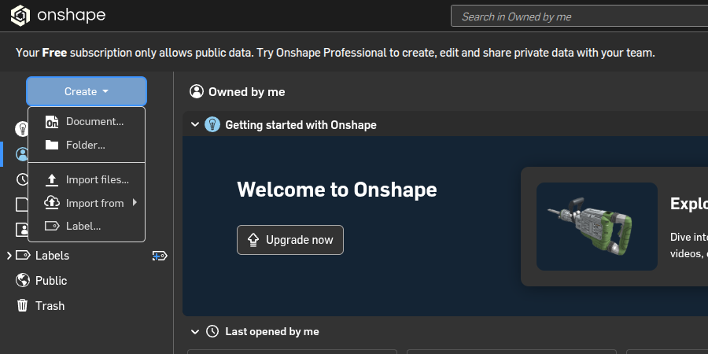

**図02｜説明用再表示。** 左上のCreateを開いた状態。Freeアカウントの公開データに関する表示も見える。

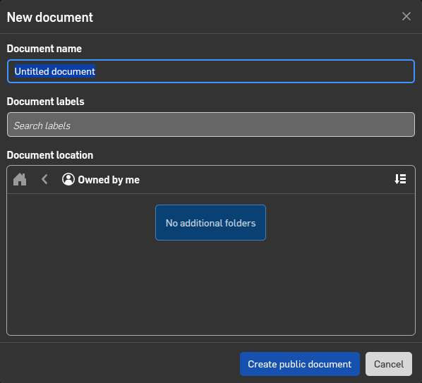

**図03｜説明用再表示。** 初期名Untitled documentの状態で撮影し、Cancelで閉じた。実行時は名前を置き換え、Create public documentを押す。

**正常の目印：** 新しいDocumentが開き、下部にPart Studio／Assemblyのタブがある。今回作成した2件は公開状態をAPIでも確認した。有料アップグレードは利用していない。

作業時、2件目のDocument本体はAPIの公開指定で作成した。このページは人が同じ公開Documentを作るためのUI手順である。

---

## 04｜STEPを選び、取り込み設定を合わせる

### 操作する場所：新しいDocumentの左下

1. 画面の**左下にある＋**をクリックする。
2. メニューの **Import…** をクリックする。
3. ファイル選択画面で02の `ID5_D405_mid_ASSEMBLY.step` を選ぶ。
4. 次のダイアログで右側の **Combine to a single Part Studio** を選び、設定を照合して **Importを1回だけ**押す。

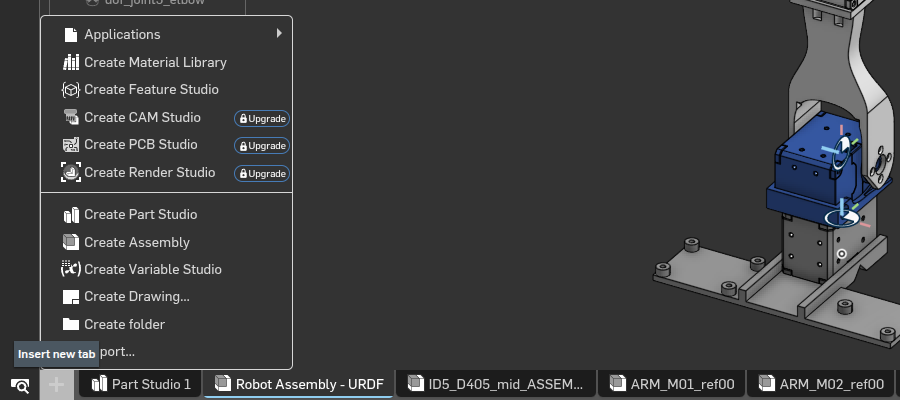

**図04｜説明用再表示。** Importはメニューの下側。Create Assemblyもこのメニューにある。

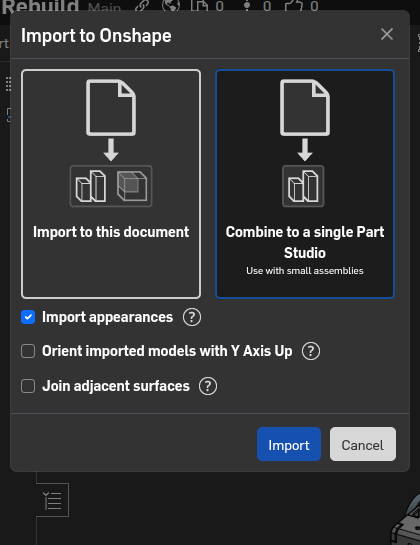

**図05｜説明用再表示。** 撮影時はCancelで閉じ、完成モデルへの再取り込みはしていない。

|項目|今回の設定|
|---|---|
|Import先|いま開いている新規Document|
|まとめ方|Combine to a single Part Studio|
|Import appearances|ON|
|Orient imported models with Y Axis Up|OFF|
|Create a composite part…|Combine選択時は表示されない。取込後にリンク別に作成|
|Join adjacent surfaces|OFF|

---

## 05｜取り込み完了を待ち、タブを見分ける

### 操作する場所：Document下部のタブと左の部品一覧

1. アップロード・変換処理が完了するまで待つ。
2. 生成されたPart Studioを開き、アームからカメラまで揃っているかを見る。
3. 描画が終わってから、描画領域へフォーカスして **F（Zoom to fit）** を押す。
4. 作成スクリプト用には、**全262ボディを含む統合Part Studio**を選ぶ。

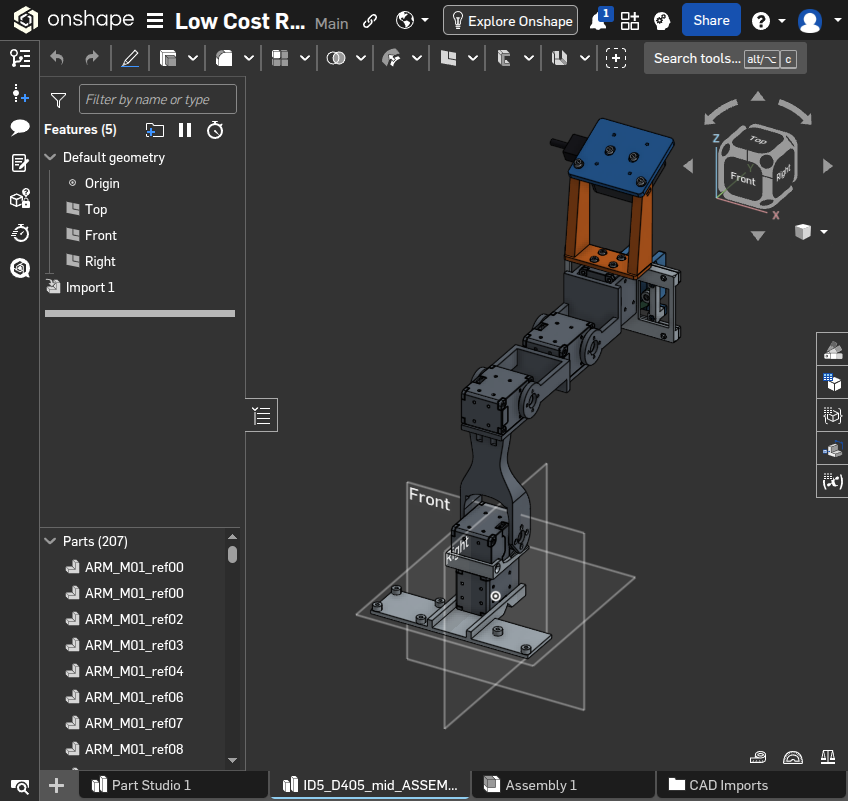

**図06｜作業時保存。** 初回の原本取込画面。後の12リンク化前なのでツリーの見え方が異なる。

### ここで起きやすい間違い

- 取込処理が進行中でも、一部のタブやAPIデータが先に見えることがある。今回も変換がACTIVEの間にデータが見えた。APIを利用する場合は最終的な **DONE** を待った。
- `ARM_M01_ref00` のような小部品Part Studioと、全体を含むPart Studioを取り違えない。
- 元のAssemblyやモーターのタブが追加で生成されても、直ちに失敗ではない。使用するタブを明示する。
- 部品名の接頭辞は主に `ARM_`、`PG3_`、`CAM5_`。後述の `bootstrap.py` は262個と接頭辞を検査する。

**保存：** 原本取り込み状態のVersionを残すと、後の軸反転・姿勢ずれを比較できる。VersionのUI操作は17に記載した。今回のV1はこの比較用である。

---

## 06｜APIキーを用意する

### 操作する場所：My account → Developer

今回、262ボディの分類・26接続点・13関節の作成はPythonから公式APIで行った。その再現にはAPIキーが必要になる。

1. [Developer](https://cad.onshape.com/user/developer) を開く。
2. **API keys** → 新規作成画面へ進む。
3. Nameを入力し、**read your documents** と **write to your documents** を選ぶ。
4. **Create API key** を押し、発行された2つの値を自分の秘密値保管先へ保存する。

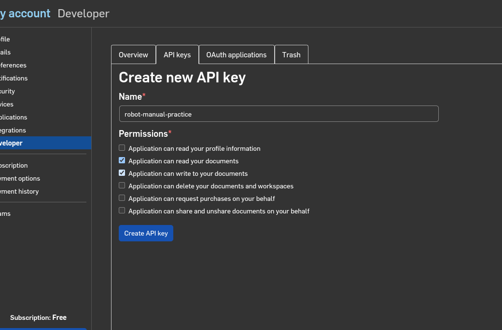

**図07｜説明用再表示。** 撮影用に権限を選択した状態。ボタンは押しておらず、追加のキーは発行していない。実作業では専用キーを1組利用した。

### 端末へ値を渡す（bash）

次のreadでは入力が画面表示されず、キーをコマンド文字列へ書かずに済む。

```bash
read -rsp 'Access key: ' ONSHAPE_ACCESS_KEY
printf '\n'
read -rsp 'Secret key: ' ONSHAPE_SECRET_KEY
printf '\n'
export ONSHAPE_ACCESS_KEY ONSHAPE_SECRET_KEY
export ONSHAPE_API=https://cad.onshape.com
```

**正常の目印：** 次ページのbootstrapが読み取りに成功すること。ブラウザのログインと、このAPI認証は別に扱った。鍵の値をスクリーンショットや公開Documentへ入れない。

---

## 07｜新しいDocumentのIDを設定する

### 操作する場所：ブラウザのURL＋ローカル端末

Onshapeの編集中URLには次の3つが入る。

```text
https://cad.onshape.com/documents/{did}/w/{wid}/e/{elementId}
```

1. 統合Part Studioを開き、`did`、`wid`、`elementId`を控える。最後が `ps` になる。
2. 空のAssemblyタブを開き、最後のIDを `asm` として控える。空Assemblyがなければ左下＋ → **Create Assembly**。
3. 配布物 `outputs` を起点として、今回専用の状態保存フォルダを作る。

```bash
cd studies/onshape-20260926/outputs
export ROBOT_BUNDLE="$PWD"
export ONSHAPE_TASK_WORK="$PWD/../work/practice-01/state"
export ONSHAPE_TASK_OUTPUT="$PWD/../work/practice-01/reports"
mkdir -p "$ONSHAPE_TASK_WORK" "$ONSHAPE_TASK_OUTPUT"
cp reproduce/project.example.json "$ONSHAPE_TASK_WORK/project.json"
```

4. `project.json` をテキストエディタで開き、4つの値を置き換えて保存する。

```json
{
  "did": "新しいDocumentのID",
  "wid": "新しいWorkspaceのID",
  "ps": "262ボディのPart StudioのID",
  "asm": "空のAssemblyのID"
}
```

ここに掲載済み完成モデルのIDを入れない。各練習は新しいDocumentと新しいstateフォルダを組にする。`bound-project.json` が、stateを別Documentへ使い回す事故を検出する。

**正常の目印：** 4IDが同じ新規Documentを指し、Assemblyが空である。Version URLの `/v/` はこの編集用設定では使わない。

---

## 08｜剛体と関節を作成する

### 操作する場所：前ページと同じ端末

各コマンドが成功してから次へ進む。終了コードが0でないときはそこで止め、Onshapeの状態とstate内のJSON記録を照合する。

```bash
cd "$ROBOT_BUNDLE/reproduce"
python3 bootstrap.py
python3 build_composites.py
python3 setup_assembly.py
python3 build_joints.py
python3 set_pose.py 90 mid
```

|コマンド|Onshapeで行うこと／確認する結果|
|---|---|
|bootstrap.py|原本262ボディとフィーチャー仕様を読み取る。`Ready to build` が出る|
|build_composites.py|全ボディを12個のclosed compositeへ分類する|
|setup_assembly.py|12個を挿入し、base_linkだけFix。タブと部品名を設定|
|build_joints.py|26個の明示Mate connectorを作り、13個のMateを設定|
|set_pose.py 90 mid|アーム4軸を0、グリッパを中間姿勢へ指定する|

**make_connectors.pyを単独実行する必要はない。** build_joints.pyが関数を呼び出す。

### ブラウザで結果を確かめる

1. Onshapeを再読み込みする。描画完了を待ってFを押す。
2. 下の **Robot Links - D405 R5** タブを開く。Composite partsが12になる。
3. **Robot Assembly - URDF** タブを開く。Instancesが12、Mate featuresが13になる。
4. 元のV1と大きく姿勢が違わないか、部品が欠けていないかを見る。

スクリプトは成功分をledgerへ保存する。ただし通信が切れた瞬間に「サーバー作成済み、ローカル未記録」が起こる可能性はある。失敗時にstateを消して最初から同じDocumentへ投入すると重複を作るため、まずツリーと記録を照合する。

---

## 09｜Compositeの意味と中身を確認する

### 操作する場所：Robot Links - D405 R5

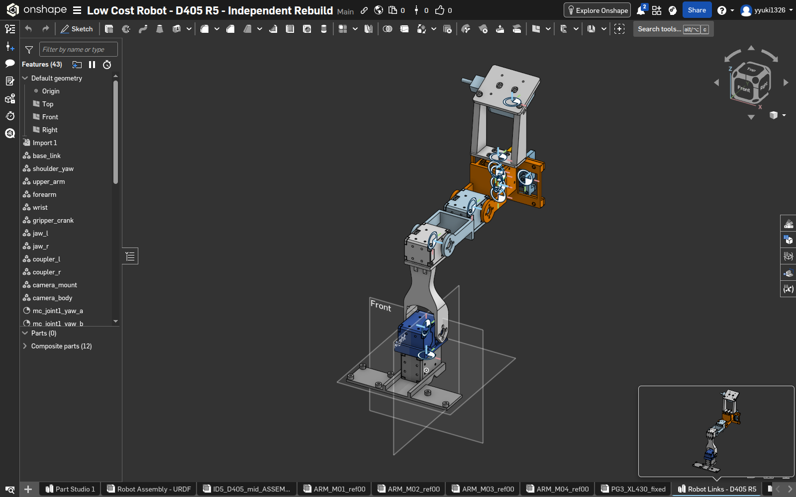

**図08｜完成後に再表示。** 左上がフィーチャー、左下がComposite parts (12)。Parts (0)は、この完成状態ではボディがclosed compositeに取り込まれた結果である。

1. 左のフィーチャーツリーで **base_link** をダブルクリックする。
2. Entitiesと **Closed** のチェックを見る。部品をひとまとまりの剛体として扱っている。
3. 見るだけなら、ダイアログ右上の**赤い×**またはEscで閉じる。

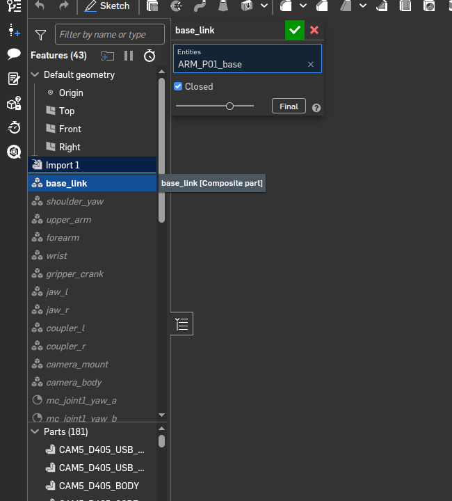

**図09｜説明用再表示・変更せず終了。** APIで作った複数ボディのクエリは、UI選択欄では代表名だけに見える場合がある。欄の行数を所属ボディ数だと解釈しない。編集途中のロールバックで下のParts数も変わる。

正確な所属一覧は `link-membership.json` を参照する。次ページに今回の分類を示す。

---

## 10｜12リンクへの分け方を理解する

### 何が一緒に動くかでまとめる

|リンク名|ボディ数|まとめたもの|
|---|---:|---|
|base_link|37|ARM_M01系＋ARM_P01|
|shoulder_yaw|37|ARM_M02系＋ARM_P02|
|upper_arm|37|ARM_M03系＋ARM_P03|
|forearm|37|ARM_M04系＋ARM_P04|
|wrist|54|M05の固定側、ARM_P05、PG3固定側|
|gripper_crank|13|クランク・ホーン・スペーサ・駆動ピン等|
|jaw_l / jaw_r|各12|左右それぞれのスライド指|
|coupler_l / coupler_r|各1|左右の連結リンク|
|camera_mount|18|取付ブラケット・取付ねじ等|
|camera_body|3|D405本体側の形状|
|**合計**|**262**|**重複・未所属がないことを検査**|

### 手で修正・別モデルへ展開するとき

同じ剛体内のねじ・スペーサは同じcompositeに含める。相対的に回転・移動する部品を1つのclosed compositeにまとめると、その動きは作れない。各ボディの名称・取付位置・設計資料を照合して分類する。

今回のM01〜M04メーカー形状は、可動ホーンとケースを独立分割していない。モーター一式を親側の粗い表示形状として残した。全モーター内部の忠実な運動モデルではない。

### 手作業による変更を保存するとき

選択や分類を変更した場合は緑の✓で確定し、後続のconnectorとMateの参照が壊れていないか確認する。今回の撮影では変更を保存していない。

---

## 11｜Mate connectorの位置と軸を確認する

### 操作する場所：Part Studioのフィーチャーツリー

1. **Robot Links - D405 R5**を開く。
2. 左のフィーチャーツリーを下へスクロールし、**mc_gripper_drive_a** をダブルクリックする。
3. Origin entity、Move、回転軸、Owner entityを見る。
4. 確認後は赤い×／Escで閉じる。

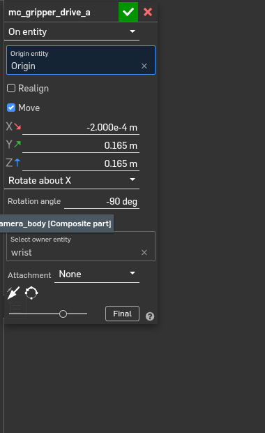

**図10｜説明用再表示・変更せず終了。** Origin基準、Move有効、Rotate about X、−90 deg、Ownerはwrist。

|項目|正確な設定値|
|---|---|
|原点|CAD全体のOrigin|
|X / Y / Z移動|−0.2 / 164.9 / 164.6 mm|
|回転|X軸まわり−90°。connectorのZ軸をCADの＋Y方向にする|
|Owner entity|親側はwrist、対になるb側はgripper_crank|

**表示の注意：** スクリーンショットのm表示は丸められ、Y/Zとも0.165 mに見える。164.9 mmと164.6 mmを同じ値へ丸めて入力し直さない。正確な全座標は `reproduce/joint_definitions.py` にある。

各Mateにつきa/bの2つを作り、合計26個。同じ位置と向きでもOwnerが異なる。明示connectorにすることで、面の自動選択に依存せず原点と軸を追跡できる。

---

## 12｜関節の種類・軸・制限を見る

### 操作する場所：Robot Assembly - URDF → Mate features

1. 下のAssemblyタブを開く。
2. 左のMate featuresで **dof_gripper_drive** をダブルクリックする。
3. **Revolute**、a/bの2つのconnector、**Limits**と数値を確認する。
4. 確認のみなら赤い×／Esc。変更した場合だけ緑の✓を押す。

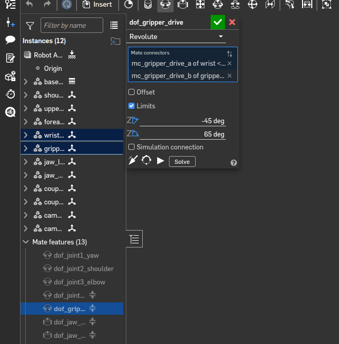

**図11｜説明用再表示・変更せず終了。** グリッパ駆動はRevolute、制限−45〜65 deg。

|Mate|種類・今回の設定|
|---|---|
|dof_joint1_yaw〜dof_joint4_wrist|アーム4軸のRevolute。J4は−110〜138°の暫定範囲|
|dof_gripper_drive|Revolute、−45〜65°|
|dof_jaw_left / right|Slider。左−7.5298725〜16.4539805 mm、右は符号反転|
|dof_coupler_left / right|Revolute、連結リンクの受動回転|
|dof_camera_mount_fixed / body_fixed|Fastened、カメラ取付部を固定|
|closing_left / right|Ball、左右それぞれの閉ループを位置で接続|

**正常の目印：** 13 MateがOK、赤いエラーやmissing referenceがない。ただしOKだけで姿勢・動作・衝突の正しさは証明できない。次のAnimateまで必ず進む。

---

## 13｜Animateで実際に動かす

### 操作する場所：Assembly左側のMate features

1. **dof_gripper_driveを右クリック**する。
2. メニュー下側の **Animate…** をクリックする。
3. Startを **−45 deg**、Endを **65 deg**、Stepsを **300** にする。
4. Playback typeを **Reciprocate**にし、▶を押す。
5. **Current valueが変わること、左右の指と連結リンクが連動すること**を確認する。
6. 停止してダイアログを閉じる。必要なら関節を右クリック→Reset、または `set_pose.py 90 mid` で比較姿勢に戻す。

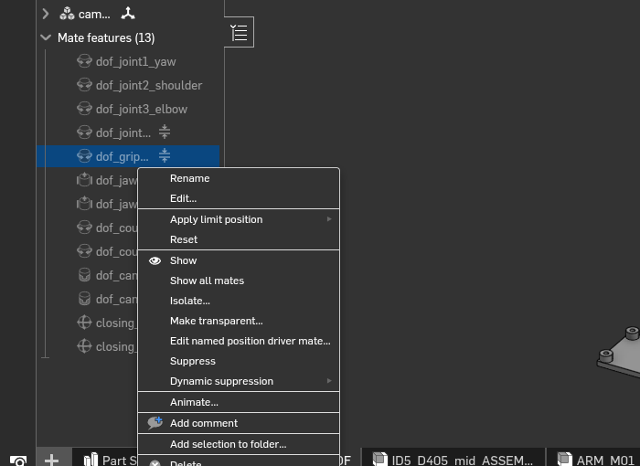

**図12｜説明用再表示。** Resetも同じメニュー内にある。

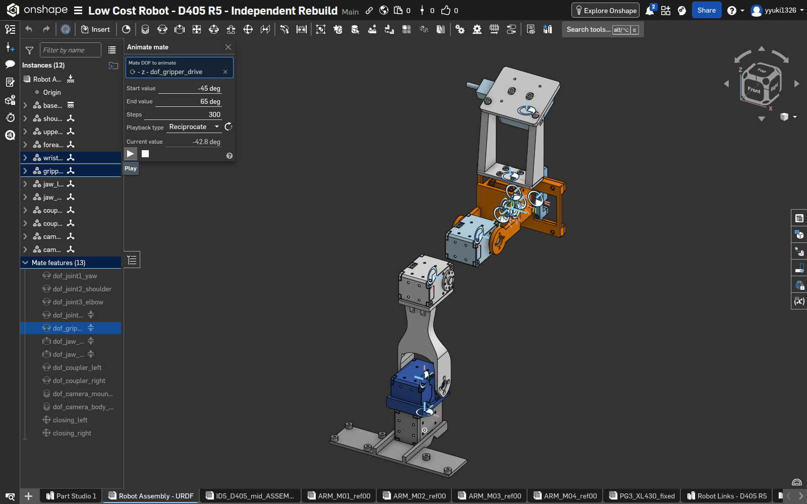

**図13｜作業時保存。** 2件目で実際にCurrent valueの変化と機構の動作を確認した画面。

角度の意味は **q＝90°−theta**。theta=135°がq=−45°の閉側、theta=25°がq=65°の開側、theta=90°がq=0°の中間。Animationのプレビュー後は、保存姿勢が狙いどおりか改めて確認する。

---

## 14｜「MateはOKなのに動かない」を調べる

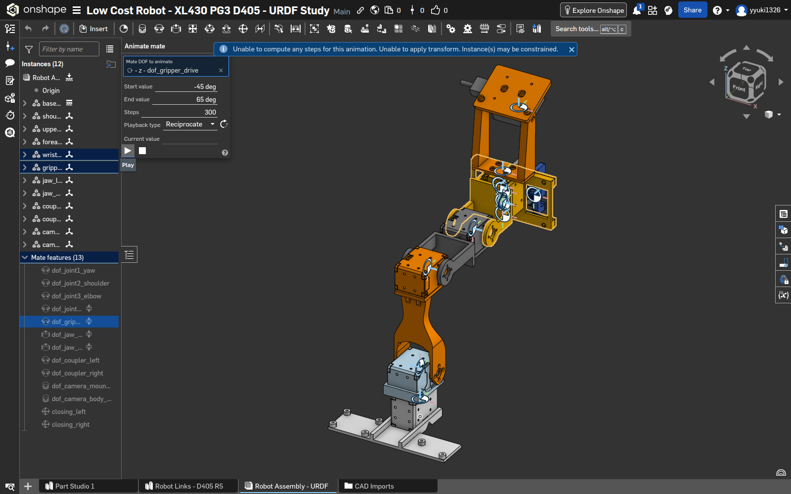

**図14｜作業時保存・修正前。** “Unable to compute any steps…”／“Instance(s) may be constrained”が出た。これを成功画面とは扱っていない。

### 切り分ける順序

1. **Fix：** Instancesでbase_link以外までFixしていないか見る。
2. **参照・拘束：** Mateのエラー、参照切れ、必要以上の拘束を確認する。
3. **軸・姿勢：** 元のV1と比較し、180°反転やねじれがないか見る。
4. **制限：** 最小・最大が同値になっていないか、角度と長さの単位が合うか見る。
5. 修正後は制限を元に戻して、再度両端までAnimateする。

### 今回見つかった原因と修正

API作成時、画面用expressionが `65 deg` でも、内部valueが0、unitsが空のままのパラメータがあった。UIに見える式だけでは動作制限が正しく設定されていなかった。

```json
{"expression": "65 deg", "value": 65, "units": "degree", "isNull": false}
```

修正版は式・数値・単位を揃え、関節種別に必要な制限パラメータだけを送る。配布のbuild_joints.pyに反映済み。制限を消したまま「直った」とはしていない。

もう1つの原因候補は軸合わせ。今回の明示connectorはa/bを同じ向きで定義したため、APIの `primaryAxisAlignment=false` を使用した。別の軸定義で無条件に同じ値を使うものではない。

---

## 15｜Interference detectionを使う

### 操作する場所：Assemblyの右下

1. 右下にある**解析ツールのアイコン**をクリックする。
2. **Interference detection…** を選ぶ。
3. ダイアログの **Instances to analyze** を選択状態にする。
4. 左のInstancesで **base_link <1>** をクリックし、Shiftを押しながら最後の **camera_body <1>** をクリックする。
5. 12個全部が対象になったことを確認する。少数しか選ばれていないと検査範囲が変わる。
6. **Interferences** の行をクリック／hoverし、モデルのハイライト位置と範囲を見る。

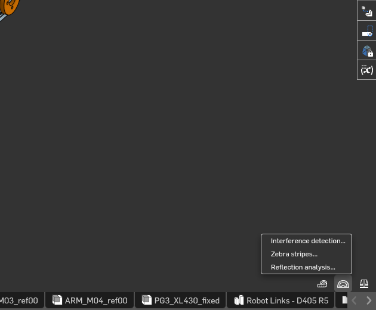

**図15｜説明用再表示。** 右下のメニューの最上段がInterference detection。

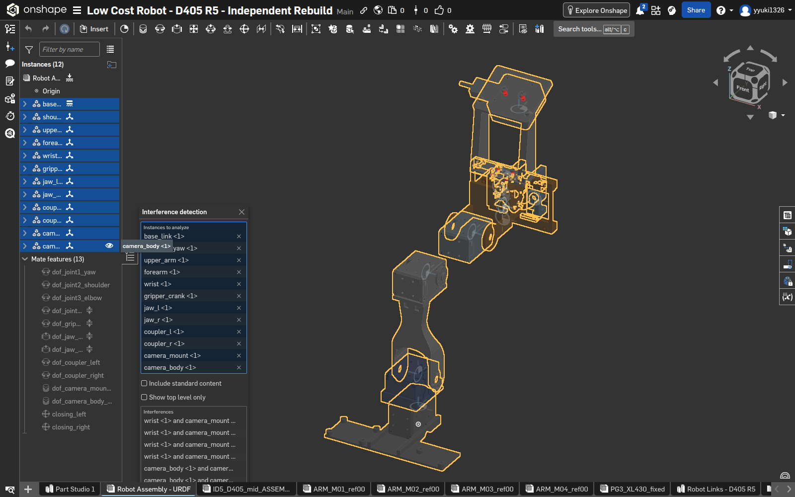

**図16｜作業時保存。** 2件目、中間姿勢、12 instanceを対象として6件を確認した。

公式ヘルプでも、解析メニューから対象を選び、干渉行とハイライトを対応させて読む手順になっている。［出典：[Interference Detection](https://cad.onshape.com/help/Content/View/interference_detection.htm)］

---

## 16｜干渉6件をどう判断したか

### 件数ではなく、場所と設計意図を確認する

|Onshapeでの組合せ|件数|同じ原本の既存レポートとの対応|
|---|---:|---|
|wrist / camera_mount|4|CAM5_BASE_TAP_0〜3 と PG3_XL430_fixed。ねじ形成取付部の交差|
|camera_body / camera_mount|2|CAM5_D405_SCREW_0〜1 と CAM5_D405_BODY。背面M3ねじ受け領域|

1. 干渉行を選び、ハイライトが想定するねじ・受けの位置か見る。
2. 同じSTEPのSHAであることを確認し、`inherited-contact-evidence.json` と原本のCADレポートを読む。
3. 「意図した締結の交差」と「意図しない可動部の衝突」を区別して記録する。
4. ねじや受けを削って件数を0にする、といった修正は行わない。

**証拠の限界：** Onshape画面で確認したのはcomposite間の組合せ・位置。細部の対応は同一入力の既存レポートに基づく。今回、その元BRep計算を新たに実行したわけではない。ねじ強度・公差・実物の挿入深さを検証した結果でもない。

### 姿勢を変えて繰り返す

前と同じ端末で、1行ずつ姿勢指定→画面更新→Interference検査を繰り返す。

```bash
cd "$ROBOT_BUNDLE/reproduce"
python3 set_pose.py 25 open
# ブラウザで全開を検査・記録
python3 set_pose.py 135 closed
# ブラウザで全閉を検査・記録
python3 set_pose.py 90 mid
# 中間へ戻して検査・記録
```

|姿勢theta|グリッパq|概算開口|両Documentの結果|
|---|---:|---:|---|
|25° 全開|65°|48.90 mm|6件|
|90° 中間|0°|15.99 mm|6件|
|135° 全閉側|−45°|0.93 mm|6件|

**対象外：** closed composite内部、sheetに関する網羅的衝突、アーム全姿勢の連続走査。3姿勢で同じ6件だから全可動域で安全、とは言えない。

---

## 17｜検証済みVersionを残す

### 操作する場所：画面左端のVersions and history

1. アニメーション・干渉検査後、中間姿勢へ戻す。
2. 左端上部の枝分かれ状アイコン **Versions and history** をクリックする。
3. パネル上部の **Create version** アイコンをクリックする。
4. Nameに例として `V2 motion and interference verified`、Descriptionに姿勢・検査対象・結果を記入し、**Create**する。

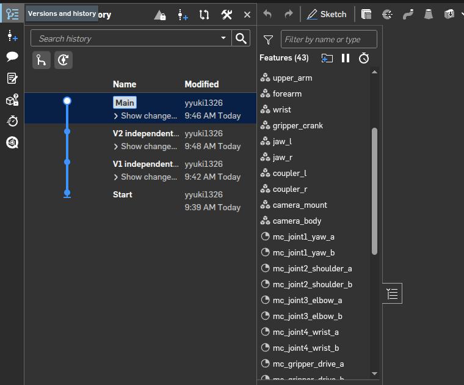

**図17｜完成後に再表示。** 2件目のV1原本とV2検証済み版が残っている。

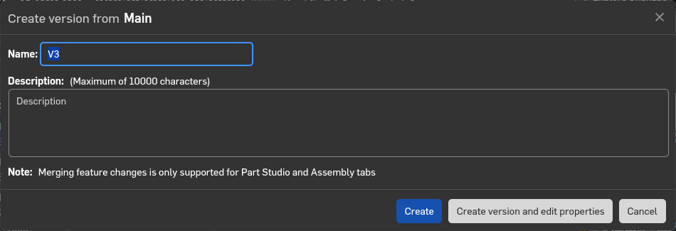

**図18｜説明用再表示。** V2作成後なので候補名がV3になっている。撮影ではCancel。今回のV1/V2本体はAPIで作成した。

5. 検証済みVersionを開き、**Assemblyタブを選択してからURLをコピー**する。 `/w/`ではなく `/v/` のURLになる。これをURDF出力の入力にする。

今回の2件目の固定版：[V2を開く](https://cad.onshape.com/documents/531556789fcbb8dfdcac2689/v/64249f2de6a8cce71fff923f/e/a0b147c03da145430a3c0bf1)。Mainは編集用、Versionはその時点の参照用、と使い分けた。

---

## 18｜外部ツールでURDFを出力する

### 操作する場所：ローカル端末

今回使ったのは **onshape-to-robot 1.8.3**。Onshape標準のExportメニューでURDFを直接選んだわけではない。公式手順どおり、API認証・Assembly URL入りconfig・出力コマンドを組み合わせる。［出典：[Getting started](https://onshape-to-robot.readthedocs.io/en/latest/getting_started.html)］

### 1. 専用Python環境を用意する

前述のAPI環境変数が設定されたbashで実行する。

```bash
python3 -m venv "$ROBOT_BUNDLE/../work/manual-export-venv"
source "$ROBOT_BUNDLE/../work/manual-export-venv/bin/activate"
python -m pip install 'onshape-to-robot==1.8.3' numpy trimesh
export ROBOT_EXPORT="$ROBOT_BUNDLE/../work/practice-01/robot"
mkdir -p "$ROBOT_EXPORT"
cp "$ROBOT_BUNDLE/robot/config.json" "$ROBOT_EXPORT/config.json"
```

今回の実作業では既存のツール実行環境を使用した。上のvenvは、人が独立した環境で再現するための準備方法である。

### 2. config.jsonを編集する

`url` を**自分の新規モデルの検証済みVersionのAssembly URL**に変更して保存する。他の設定は今回の同一モデルなら維持する。

|設定|今回の値・理由|
|---|---|
|output_format / output_filename|urdf / robot|
|no_dynamics|true。密度・質量・慣性が未確定|
|joint_properties.default|effort / velocityは0の未設定値|
|jaw_left/right, coupler_left/right|actuated=false。受動関節|

### 3. 実行する

```bash
onshape-to-robot "$ROBOT_EXPORT"
```

**正常の目印：** `robot.urdf` と `assets/` が生成される。URLがPart Studioを指していないか、出力前に見直す。新しい出力先を使い、配布済み原本を上書きしない。

---

## 19｜未加工URDFを残して利用版へ整える

### 操作する場所：ローカル端末

未加工出力は `package://assets/...` 参照とゼロ慣性等を含んだ。今回の可視化・運動学用途向けに次を行った。

|変更|目的|
|---|---|
|未加工XMLを別名保存|エクスポータの原本を保持する|
|mesh参照を `assets/...` にする|URDFとassetsを同じフォルダで持ち運べるようにする|
|inertialを除去|未確定のゼロ質量・ゼロ慣性を有効な物理値として扱わせない|
|fixed jointのaxis/limitを除去|固定関節に不要な要素を整理|
|補助link直下のoriginを除去|link直下の非標準要素を整理|

```bash
python "$ROBOT_BUNDLE/reproduce/make_portable.py" "$ROBOT_EXPORT"
cp "$ROBOT_BUNDLE/robot/pg3_states.py" "$ROBOT_EXPORT/"
cp "$ROBOT_BUNDLE/robot/validate_robot.py" "$ROBOT_EXPORT/"
python "$ROBOT_EXPORT/validate_robot.py"
```

`make_portable.py` は今回の変換処理を再現用に整理したもの。no_dynamics=true、16リンク／15関節、メッシュ存在を確認し、最初の未加工XMLを保持する。**同じフォルダへ再エクスポートするより、新しい出力フォルダを使う。** 既存rawがある場合はそちらを変換元にするためである。

### フォルダの完成形

```text
robot/
  config.json
  robot.onshape-raw.urdf   ← 未加工
  robot.urdf               ← 利用版
  assets/                  ← 12形状のSTL等
  pg3_states.py            ← 非線形な関節連動
  validate_robot.py        ← 数値検査
  validation.json          ← 検査結果
```

ROS package URLが必要なら、実際のパッケージ名に合わせて参照を変更する。材料や実測慣性がある別ロボットに、このinertial除去をそのまま適用しない。

---

## 20｜URDFで閉ループを維持し、検査する

### 操作する場所：ローカル端末・URDF利用アプリ

```bash
python "$ROBOT_EXPORT/pg3_states.py" 25
python "$ROBOT_EXPORT/pg3_states.py" 90
python "$ROBOT_EXPORT/pg3_states.py" 135
```

戻り値は `joint_positions`。回転はrad、スライダはm。アーム4軸の0と、グリッパ5関節の値を返す。グリッパdriveだけでなく、**左右jawと左右couplerにも同時に値を渡す**。URDFは木構造なので、Onshapeの閉ループ拘束を自動では解かない。通常の線形mimicではこの非線形連動を表せない。

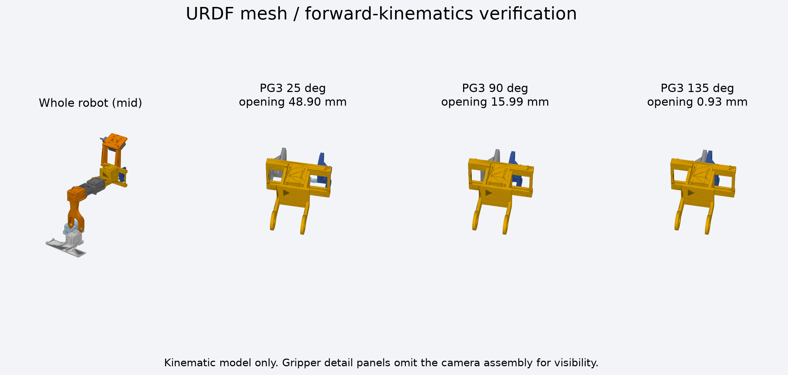

**図19｜作業時に生成したURDF描画。** Onshapeのスクリーンショットではなく、出力メッシュと関節値からローカルで描いた図。

### validation.jsonで見る値

|項目|今回の結果|
|---|---|
|status|PASS_KINEMATIC_ONLY|
|links / joints|16 / 15（形状リンク12＋閉ループ補助フレーム4）|
|駆動 / 受動 / 固定|5 / 4 / 6|
|sampled_configurations|441（theta25〜135°を0.25°刻み）|
|max_closure_error_m|約2.31×10⁻⁷ m＝0.23 µm|

検査は木構造、親子関係、メッシュ存在・スケール、ゼロ姿勢、関節範囲、左右の閉ループ点の位置残差を確認する。**0.23 µmは数値上の残差であり、実機の加工精度・把持精度ではない。** ROS／実機での運転試験を通したものではない。

---

## 21｜別プロジェクトで同じモデルを再作成する

### 操作する場所：新しいOnshape Documentと、新しいstateフォルダ

1. 03に戻って新しい公開Documentを作る。完成モデルのコピーからは始めない。
2. 同じSHAのSTEPを再アップロードする。
3. 新しいdid/wid/ps/asmを控える。ボディ・feature・instanceのIDを初回から流用しない。
4. `practice-02/state` と `practice-02/reports` を新設し、環境変数を切り替える。
5. bootstrap → composites → assembly → joints → midを実行する。
6. Animateと、全開・中間・全閉の干渉検査をやり直す。
7. Versionを保存し、新しい出力先にURDFを書き出して検査する。

### 今回の2回目で確認したこと

|比較対象|結果|
|---|---|
|剛体・関節の構成|同じ12リンク、同じMate構成|
|URDFの構成|リンク名・関節名・親子・種類が一致|
|12メッシュ|双方向最近傍頂点距離0、面積・三角形数も一致|
|回転行列|最大差約5.31×10⁻⁶。書出し丸めの範囲|
|ネイティブ動作・干渉|Animate動作、3姿勢それぞれ6件|

**STLのハッシュだけで不一致にしない。** 三角形の順番が変わり、同じ形状でもバイト列は変わる。今回は座標・面積・三角形数を比較した。数値は `rebuild/comparison.json` に記録している。

### 今回育てたスキル

`onshape-robot-workflow/` に、取込、軸・制限、Reset、ネイティブ検証、URDF出力の手順を残した。Findingsは `WORKLOG.md`。再作成で見つかった「gripperだけ指定すると自由なアーム軸が少し動く」問題に対し、set_pose.pyはアーム4軸の0も同時指定するよう更新した。

---

## 22｜Free枠と、再開時のチェック

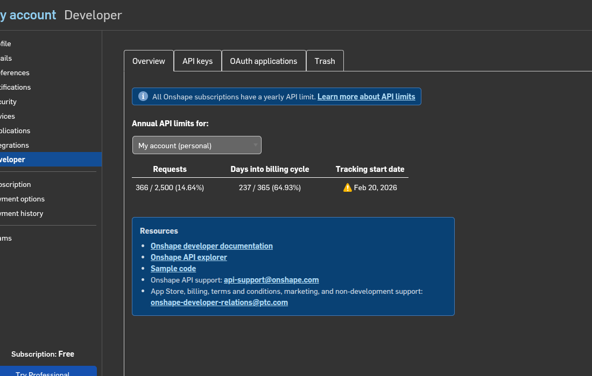

**図20｜マニュアル作成時に再表示。** My account → Developer → Overview。Free表示と年間API使用量を確認できる。利用量は他の処理でも増えるため、作業前に現在値を読む。

### 再開時に役立ったこと

|症状|確認・操作|
|---|---|
|Session has timed outでクリックできない|Documentは保存されている表示を確認し、ブラウザを再読み込みする。今回の撮影再開でも復帰した|
|API更新後に一部の形状が見えない|再読み込み→描画完了→F。見た目だけで形状が消えたと判断しない|
|13 MateがOKだが姿勢が反転|V1と比較、connectorの軸方向を確認。必要なら右クリック→Reset|
|全体を原点へ戻したつもりなのに動かない|拘束されたAssemblyのtransform変更が効いたと決めつけない。Mate値と実際の姿勢を見る|
|干渉が0件になった|選択対象が12個あるか、正しい姿勢かを先に確認|
|APIが失敗した|HTTP応答・認証・公式Developer利用量とledgerを見る。長い無条件リトライをしない|

### 作業終了時

- 中間姿勢へ戻し、12 Instances・13 Mateとエラーの有無を確認する。
- Version URL、原本SHA、姿勢、検査対象、結果数を作業記録へ残す。
- URDFとassetsを一緒に保存し、validation.jsonも添える。
- この作業用に読み込んだ秘密値は端末で `unset ONSHAPE_ACCESS_KEY ONSHAPE_SECRET_KEY` により解除できる。

今回のFree枠の実行では有料機能・購入を使用していない。画面に出るUpgradeやTry Professionalは、この手順では使用しない。

---

## 23｜成果物の場所と確認できた範囲

### Onshapeで開く

- [初回：Low Cost Robot - XL430 PG3 D405 - URDF Study](https://cad.onshape.com/documents/1f8f316ef4f488303d1c1902/w/ac6b81ffda999cf35e941d15/e/282c9739d5fb8e5aa9a89f3f)
- [2回目：Low Cost Robot - D405 R5 - Independent Rebuild](https://cad.onshape.com/documents/531556789fcbb8dfdcac2689/w/f18636c9c4ee7993d5afbbaa/e/a0b147c03da145430a3c0bf1)
- [2回目の検証済み固定Version](https://cad.onshape.com/documents/531556789fcbb8dfdcac2689/v/64249f2de6a8cce71fff923f/e/a0b147c03da145430a3c0bf1)

### 配布フォルダの地図

|outputs内の相対パス|内容|
|---|---|
|manual/MANUAL.html / MANUAL.pdf / MANUAL.md|このマニュアル。HTMLは画像を内包し、クリックで拡大可能|
|WORKLOG.md|作業経緯・Findings・Tips|
|VALIDATION_GUIDE.md|短い検証手順|
|robot/、rebuild/robot/|初回と再作成のURDF・メッシュ・検査結果|
|source-manifest.json、link-membership.json|入力の同定、262ボディの所属|
|native-validation.json、rebuild/native-validation.json|ネイティブ姿勢と閉ループ位置の記録|
|inherited-contact-evidence.json|既存CADレポートから継承した接触根拠|
|reproduce/|今回の構成に対応した再現用スクリプト|
|onshape-robot-workflow/|育成したスキルの配布コピー|

### このモデルで未確定のこと

動力学、実測質量・慣性、実機ホーム、トルク・速度制限は未確定。effort/velocityの0、J1〜3の±πは実機運転値ではない。J4の範囲は既存の2°刻みCAD診断に基づく暫定値。カメラ本体リンクは校正済み光学フレームではない。衝突用に単純化したメッシュの妥当性や、全アーム連続可動域は未検証。

元データの権利表記は `robot/NOTICE.md` と `robot/licenses/` にある。今回の取り込み・メッシュ化で元のライセンスが置き換わるわけではない。

---

## 24｜画像の来歴・公式資料・練習用記録欄

### 画像の読み分け

**作業時保存：** 図06（初回取込）、図13（Animate成功）、図14（修正前の失敗）、図16（干渉検出）。図19は作業時にローカルで生成したURDF描画。

**完成後に再表示：** 図01、08、17、20。モデルや利用量をマニュアル作成時点で再び表示したもの。

**説明用再表示：** 図02〜05、07、09〜12、15、18。メニューや編集・作成フォームを開いて撮影し、作成確定や編集保存をせず閉じた。秘密キーの値を写した画像は含まない。

追加証拠画像として `images/11b-interference-open.png`、`images/11c-interference-closed.png` に作業時の全開・全閉結果も収録した。

### 参照した公式資料

- [Onshape：Interference Detection](https://cad.onshape.com/help/Content/View/interference_detection.htm)
- [Onshape：Mates](https://cad.onshape.com/help/Content/Assembly/mates.htm)
- [Onshape：Error Indicators](https://cad.onshape.com/help/Content/Home/error_indicators.htm)
- [Onshape：Mate値で正確に位置指定](https://www.onshape.com/en/resource-center/tech-tips/precisely-position-mates)
- [onshape-to-robot：Getting started](https://onshape-to-robot.readthedocs.io/en/latest/getting_started.html)
- [onshape-to-robot：設計規約](https://onshape-to-robot.readthedocs.io/en/latest/design.html)
- [onshape-to-robot：閉ループ](https://onshape-to-robot.readthedocs.io/en/latest/kinematic_loops.html)

### 練習時に残す記録

|項目|自分の作業結果|
|---|---|
|日付・Document URL・Version URL| |
|入力STEPのSHA-256| |
|取込ボディ数／composite数／Mate数| |
|Animateの範囲・Current valueの変化| |
|全開／中間／全閉の検査対象・干渉数| |
|各干渉の組合せ・場所・判断根拠| |
|URDF検査結果・最大閉ループ残差| |
|気づき・失敗・修正・残る未検証事項| |

