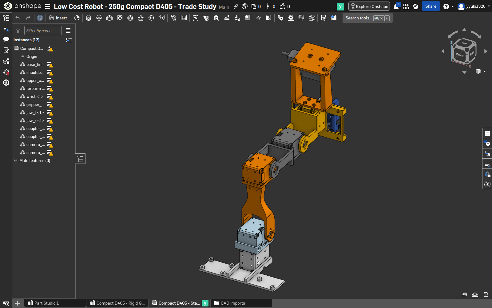
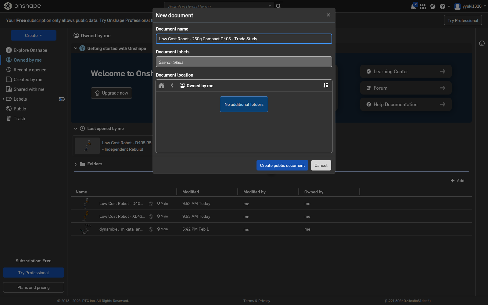
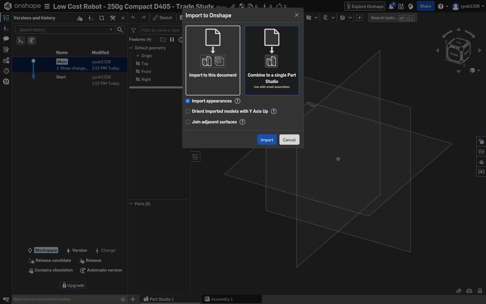
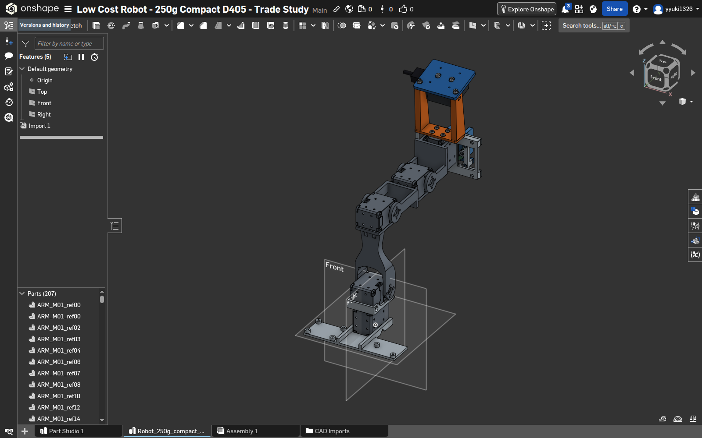
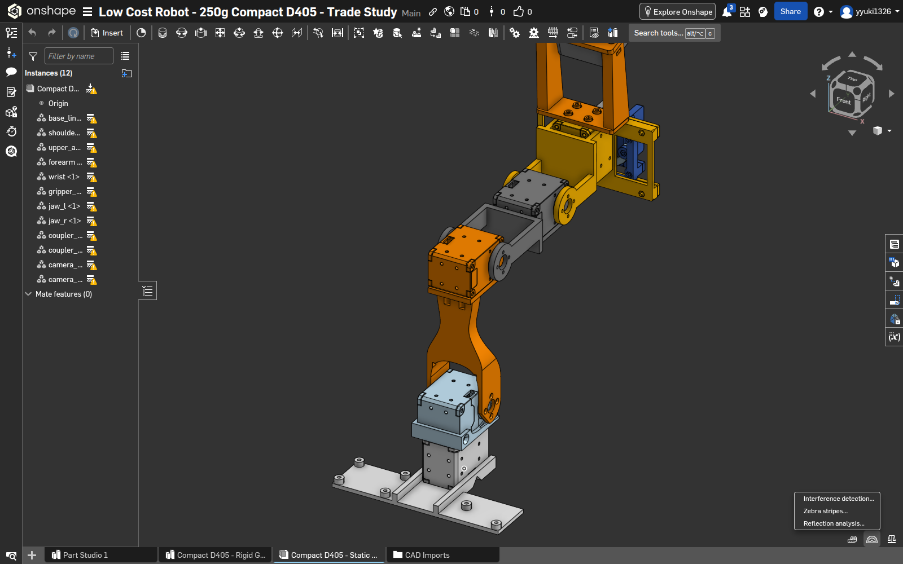
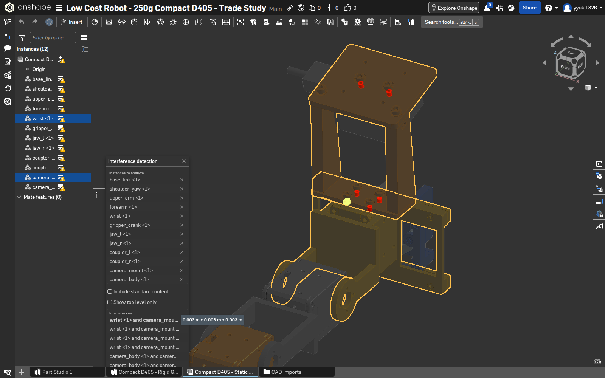
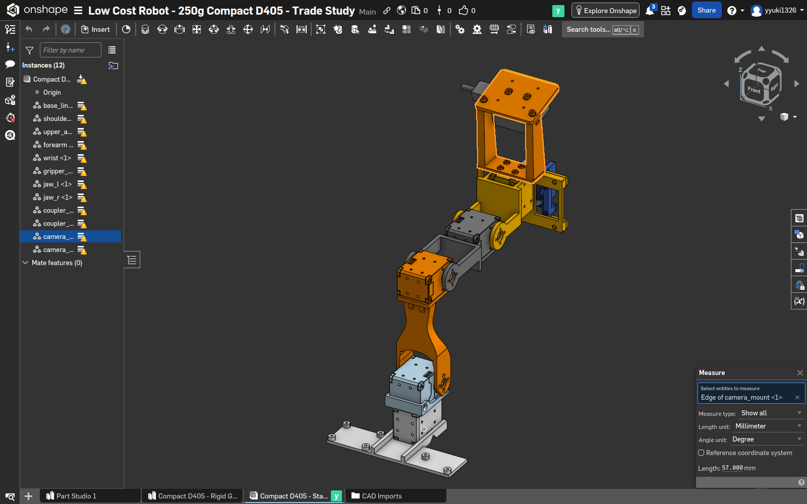
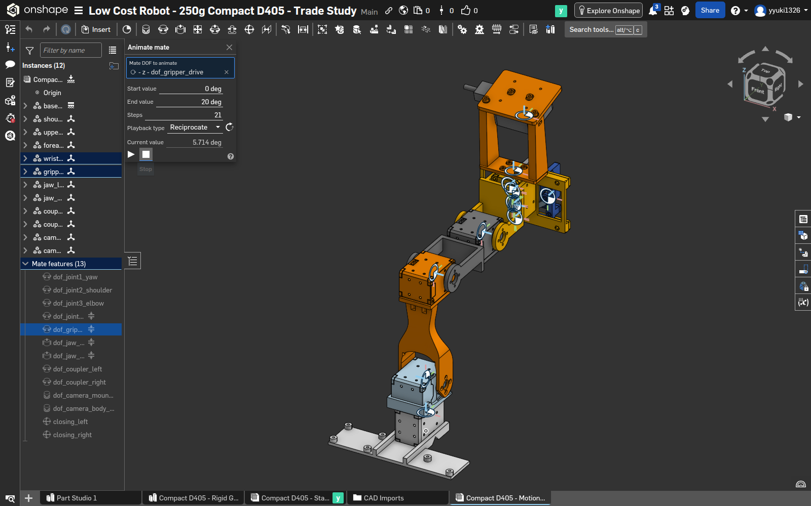
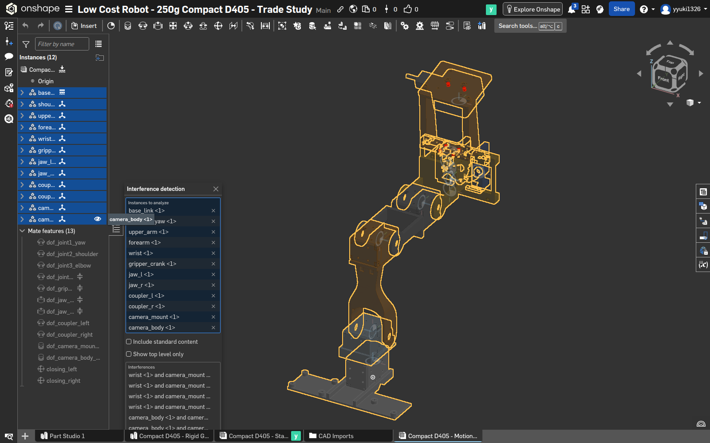

# D405短縮候補をOnshapeで検証する

2026-09-26 / Free・Public / 人間向け操作記録

この手順は、約250 g把持を想定した短縮候補を、新しい公開文書へ取り込んだ実作業の記録である。使用ファイルは [Robot_250g_compact_D405.step](CAD/Robot_250g_compact_D405.step)。結果の意味と限界は [REPORT](REPORT.md)、操作の日時は [WORKDOC](WORKDOC.md) に記録した。

元モデルをゼロから別文書へ取り込み、可動関節とURDFを作った手順は [前の一連のマニュアル](../manual/MANUAL.html) にまとまっている。今回も静的検査に続いて**別の可動Assemblyと新URDF**まで作成した。9〜12章が追加した最終工程である。

[今回の可動V2を開く](https://cad.onshape.com/documents/7b85d8922959cbe564b6e0cb/v/e21cffef1877c8f91d2b03f8/e/848ae15cd82797bd99cdc330)。画像はクリックして拡大できるHTML版も用意した。

---

## 1. 新しい公開文書を作る

1. Onshapeへログインし、Documents画面で **Create → Document** を開く。
2. 名前を `Low Cost Robot - 250g Compact D405 - Trade Study` と入力する。
3. Freeの公開文書であることを確認し、**Create public document** をクリックする。

作成された文書IDは `7b85d8922959cbe564b6e0cb`。今回は公開保存を許可されたロボットCADだけを取り込んだ。APIの公開判定フィールドは `public: true` だった。`isPublic` という想定で確認すると誤判定になる。

---

## 2. STEPを取り込む

1. 文書下部左端の **＋ → Import** を選び、候補STEPを指定する。
2. **Combine to a single Part Studio** を選ぶ。
3. 外観を使う設定をON、Y-up変換とJoinはOFFにしてインポートを開始する。
4. インポート完了を待つ。タブが見えても翻訳処理が終わっていない場合がある。

元STEPは257 occurrenceだが、Onshapeでは207 solid＋55 sheet＝262 bodyになる。一つのoccurrenceに複数bodyが含まれるため、この差だけを欠損と判断しない。

---

## 3. 取り込み結果を確認する

Part Studioを開き、モデルの姿勢・スケール・部品一覧を確認する。実作業ではbody一覧をAPIで取得し、262 bodyが存在することを記録した。モデルが一部描画されなければ、読み込み完了後に再読み込みし、**F / Zoom to fit** で全景を確認する。

このPart Studioを `Compact D405 - Rigid Groups` と命名した。元のV2可動モデルは別文書で保存したままにした。

取り込みだけで可動性、強度、製造可能性まで合格したことにはならない。面モデルは体積0のことがあり、体積干渉だけでは衝突を否定できない。

---

## 4. 検査用の12部品を用意する

262 bodyを、base_link、shoulder_yaw、upper_arm、forearm、wrist、gripper_crank、jaw_l/r、coupler_l/r、camera_mount、camera_bodyの12グループへまとめた。個数は順に37/37/37/37/54/13/12/12/1/1/18/3で、合計262。

手動ならPart Studioで対象bodyを選択し **Composite part → Closed** を使い、Assemblyの **Insert** で挿入する。対象bodyの正確な所属は [link-membership.json](reports/link-membership.json) を参照する。

**今回の実操作は、このグループ作成と12固定instance挿入をAPIスクリプトで行った。** 画面で262 bodyを手選択したとは記録しない。実行スクリプトはローカル `work/build_composites.py` と `work/optimization/onshape_static.py`。環境変数 `ONSHAPE_TASK_WORK` を今回の `work/optimization/onshape`、`ONSHAPE_TASK_OUTPUT` を今回のreportsへ指定して実行した。

Assembly名は `Compact D405 - Static Validation`。12部品を全て固定しているので、左の黄色警告へカーソルを置くと **More than one part is fixed** と表示される。今回の静的な寸法・干渉確認ではこれを記録して保持した。可動機構を作る段階では基部だけを固定し、関節と連結関係を定義する。

閉じたcompositeの内部干渉は、instance間検査に現れないことがある。今回は別途、元の個別CADで3把持姿勢の交差も検査した。

---

## 5. Onshapeの干渉検出を使う

1. Assembly右下の **Show analysis tools** をクリックする。
2. メニューの **Interference detection…** を選ぶ。
3. 左のInstances一覧で最初の `base_link` を選択し、Shiftを押しながら最後の `camera_body` を選び、12部品すべてを対象にする。
4. 結果件数を確認し、行をクリックして、どこが重なっているかハイライトで確認する。

公式操作説明: [Interference detection](https://cad.onshape.com/help/Content/View/interference_detection.htm)。ダイアログ内の対象数を必ず確認し、1部品だけの結果を全体検査と取り違えない。

---

## 6. 干渉6件をどう解釈したか

結果は `wrist / camera_mount` が4件、`camera_body / camera_mount` が2件。個別CADの比較で、前者は固定ねじ4本とケース包絡、後者はカメラねじ2本とカメラ包絡に対応し、元R5にも同じ組があることを確認した。

「既存6件」と記録し、無条件に削除・無視して干渉0にしていない。名目包絡なので実ねじの溝や内部穴を完全には表さず、実物の締結確認は別に必要。

さらに非solidのモータ面モデル4件は、CAD側で包絡箱が重なるため未解決として残した。Onshapeで6件と出ることだけから、全モデル・全姿勢が無干渉とは判定しない。

---

## 7. エッジ長をMeasureで測る

1. Escapeで前の操作を終え、モデル上のキャリア板の長辺にある**直線エッジ**をクリックする。左のcomposite名だけを選んでも、今回のMeasure入力には入らなかった。
2. 右下の **Show measure details**、またはショートカット **[** を使う。
3. 入力欄が **Edge of camera_mount <1>** になっていることを確認する。
4. **Length unit → Millimeter** とする。表示された値は **Length: 57.000 mm**。

この長さは角の丸みを含まない直線部分で、板の全幅63 mmとは異なる。保存STEPでも57 mmの直線エッジを照合した。操作時の1600×1000画面では選択点はおよそ(1051,154)だったが、次回は画像上の形状とハイライトを見て選び直す。固定座標や古い自動操作refを使い回さない。[公式Measure説明](https://cad.onshape.com/help/Content/View/measure_tool.htm)

---

## 8. 静的V1の保存とheadless移行

干渉・計測を確認した後、APIから **V1 compact candidate - static interference and measure** を作成し、バージョン一覧GETで存在を確認した。手動では左側の **Versions and history → Create version** から名前を付けて保存できる。

保存版IDは `32664265918984b8b6cebbd8`。文書の説明にも高さ低減、負荷低減、質量微増、可動範囲減少、強度未検証を記載した。

途中でユーザーの指示により、状態を作業書へ記録してからheadlessへ移行した。以後は `onshape-headless` を使い、永続プロファイルでログインとHTTPキャッシュを保持する。[具体的な起動コマンドとキャッシュ](HEADLESS.md)

この時点では静的V1のみだった。その後、次章から可動Assemblyを新設し、短縮候補のURDFを実際に再出力・検証した。前のURDFは [元モデル用](../robot/README.md) として保存している。

## Findings / Tips

| 観察 | 次回の操作 |
|---|---|
| ツリーが見えても3D描画が遅れる | ロード完了後の画面で確認する |
| body数とSTEP occurrence数が違う | 名前・内訳・所属で全数照合する |
| Measureが空欄 | モデル上の実エッジ/面を選び、入力entity名を確認する |
| 複数固定に黄色警告 | 文言をhoverで確認し、静的検査と可動組立を区別する |
| 最短ホルダーが可動域を悪化させた | 初回候補を保存し、近隣7案を再比較して採否を記録する |
| headlessでもCADが描画できた | セッションを分けて認証移行、初回待機と結果確認を行う |

耐久性、実機深度、材料・印刷条件が未確認である点は [REPORT](REPORT.md) の末尾にまとめた。

---

## 9. 別Assemblyに関節を作る

文書下部に `Compact D405 - Motion and URDF` を新設し、同じ12 compositeを挿入した。手動では **＋ → Create Assembly → Insert** の順。基部 `base_link` だけ右クリック **Fix** とし、残り11部品は固定しない。

**実作業はAPIスクリプト `work/optimization/motion_pipeline.py` のsetup/buildで行った。** 26個の明示Mate connectorと13 Mateを作成。UIで全てを手入力したという記録ではない。手動操作の画面例は [前のマニュアル](../manual/MANUAL.html) のMate connector/Mate章を参照する。今回の全入力値は [joint-definitions.json](robot/joint-definitions.json) に保存した。xyzはCAD世界座標mm、axis/rotはconnectorの姿勢指定である。

| 接続 | Mate / 変更点 |
|---|---|
| base→yaw→upper→forearm→wrist | Revolute 4軸。手首だけ−106〜+138° |
| wrist→crank | Revolute、−45〜+65° |
| wrist→左右jaw | Slider、左右逆方向 |
| crank→左右coupler | Revolute |
| coupler→左右jaw | Ballで閉じる2本のループ |
| wrist→mount→camera | Fastened。camera glass中心[-0.2,185,250] mm |

名前はツリー側を `dof_...`、閉じる2本を `closing_left/right` とする。これはexporterの関節/閉ループ認識に使う。13件全てOKであっても動作成功とは限らないので、次章の実動確認へ進む。

---

## 10. Animateで実際に動かす

1. 左のMate featuresで `dof_gripper_drive` を右クリックし **Animate…** を選ぶ。
2. Start **0 deg**、End **20 deg**、Steps **21**、Reciprocateを指定する。
3. 再生ボタンを押し、**Current valueが変わり、指が動く**ことを確認する。
4. 停止ボタンを押す。撮影時は5.714°で停止した。ダイアログを閉じた後、比較用の中間姿勢へ戻す。

今回、再生中Current valueは3.81→15.238°へ変化した。API試験ではアーム4軸＋driveの5値を毎回明示し、各軸10°、手首両端、把持開/中/閉の11姿勢を確認した。

大きな一括ジャンプはHTTP成功でも目標値に未達だった。基準へ戻し、最大10°刻みの91中間移動で再試験し、実値を毎回照合して成功した。古いUI refも使い回さず、更新後のsnapshotで対象を選び直す。

---

## 11. 可動Assemblyの干渉と保存V2

Animateを閉じ、アーム4軸0、drive0（CAD theta90°）へ戻す。右下解析メニューから **Interference detection…** を開き、Instancesの `base_link` から `camera_body` までShift選択する。

12対象と、wrist/mount 4件・camera/mount 2件を確認した。これは基準姿勢のGUI結果。3把持姿勢の詳細CAD体積比較は [validation.json](reports/validation.json) にあり、UIのこの1枚を3姿勢の証拠とはしない。

基準姿勢への復帰誤差4.50e-15をAPIで確認後、**V2 compact motion validated - URDF source** を保存した。手動なら **Versions and history → Create version**。実際はAPI作成と一覧GETで存在確認した。

[V2を開く](https://cad.onshape.com/documents/7b85d8922959cbe564b6e0cb/v/e21cffef1877c8f91d2b03f8/e/848ae15cd82797bd99cdc330)。URLの `/v/` は固定保存版、編集可能な作業版は `/w/`。最終出力はこのV2に固定する。

---

## 12. URDF出力・ローカル検証

onshape-to-robot 1.8.3のconfigに前章V2のURLと `no_dynamics: true` を設定して出力した。12 STLと未加工XMLを得た後、既存 `outputs/reproduce/make_portable.py` で相対参照の利用版へ変換。秘密鍵はwork内から環境へ渡し、配布物には入れない。

| ファイル | 確認するもの |
|---|---|
| [robot.urdf](robot/robot.urdf) + assets/ | 16 links / 15 joints / 12形状。短縮候補の実出力 |
| [source-manifest.json](robot/source-manifest.json) | 新V2・CAD・URDF・STLのSHA256 |
| [pg3_states.py](robot/pg3_states.py) | drive、左右jaw、左右couplerを同時に計算 |
| [validate_robot.py](robot/validate_robot.py) | 木構造、SI、基準姿勢、441点閉リンク、実11姿勢のFK比較 |

[実行コマンド・使い方](robot/README.md) のとおりvalidatorを実行すると `PASS_KINEMATIC_ONLY`。閉リンク位置誤差最大0.231 µm、Onshape実姿勢との行列要素差最大8.551e-6だった。行列差は回転/並進を含むため距離とは呼ばない。

旧版STLの厳密一致はforearm/wristで不成立だった。旧meshを流用して合格にはせず、失敗を [診断JSON](reports/mesh-surface-diagnostic.json) に保存し、CAD元形状と今回の出力元を別途照合した。

完成したのは運動学モデルである。慣性・実機校正・effort/velocityは未確定。250 g耐久性や連続運転可否は、この合格表示の対象ではない。頭からの全操作は [作業書](WORKDOC.md)、考察は [REPORT](REPORT.md) に残した。
