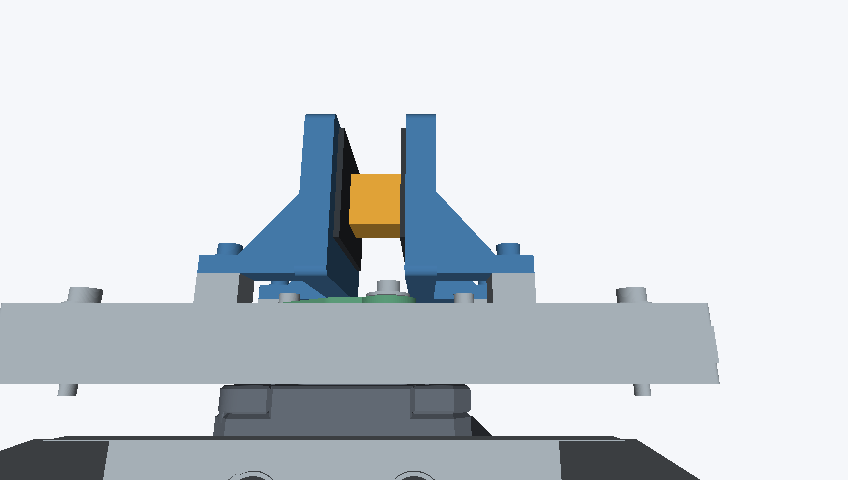
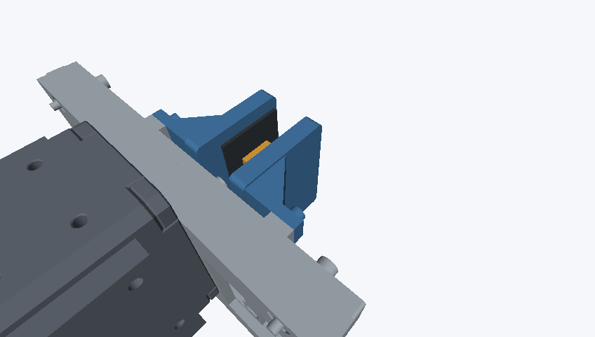

# 250 g把持を想定したD405マウント短縮案

2026-09-26。候補 **C_y185_z250_p75** を実体CADにし、Freeの公開Onshapeへ取り込んだ。モータ上面からの上部高さを **9.49 mm**、カメラ周辺の手首重力トルク振幅を **6.8%** 減らす案である。手首の片側可動範囲は4°減り、質量は約0.18 g増える。比較設計の成果であり、250 gの連続運転や耐久性を認定したものではない。

[Onshape可動V2](https://cad.onshape.com/documents/7b85d8922959cbe564b6e0cb/v/e21cffef1877c8f91d2b03f8/e/848ae15cd82797bd99cdc330) · [今回のURDF](robot/README.md) · [全体STEP](CAD/Robot_250g_compact_D405.step) · [画面付き操作手順](MANUAL.md) · [headless再開](HEADLESS.md) · [作業記録](WORKDOC.md)

## 何を変えたか

世界座標はX右・Y接近方向・Z上、単位mm。D405のガラス中心を `(-0.2,197,257)` から `(-0.2,185,250)` へ移し、俯角を65°から75°へ変更した。後方12 mm、下方7 mmの移動で、カメラ・キャリア・USBプラグ・短いケーブルを一緒に再配置し、支持材を作り直した。固定4穴と5モータ構成は維持している。

キャリアは63×54×4 mm、側板は厚さ8 mm。カメラ用M3×6の頭下実厚は3 mm、名目挿入量3 mm、仕様の最大4 mmに対して1 mm余裕を持つ。実物のねじ噛み合い・底付きは未確認。部品は [ベースSTEP](CAD/CAM5_BASE.step)、[キャリアSTEP](CAD/CAM5_D405_CARRIER.step) と、それぞれのSTLを同じCADフォルダへ保存した。

## 同じ前提での比較

| 指標 | 元R5 | 短縮候補 | 解釈 |
|---|---:|---:|---|
| モータ上面からの上部高さ | 92.19 mm | 82.70 mm | 10.3%減 |
| カメラ周辺全体の仮定質量 | 117.05 g | 117.23 g | 軽量化していない |
| 同重心Y / Z | 183.70 / 258.44 mm | 175.76 / 253.93 mm | 手首へ近づく |
| カメラ周辺の手首重力トルク振幅 | 0.14066 Nm | 0.13109 Nm | 6.8%減 |
| 基準姿勢のカメラ周辺＋250 g：手首Xモーメント絶対値 | 0.35941 Nm | 0.35041 Nm | 2.5%減 |
| 同：肩Xモーメント絶対値 | 0.73700 Nm | 0.72819 Nm | 1.2%減 |
| 2°刻みで確認した手首区間（CAD正方向） | −138〜+110° | −138〜+106° | 正側4°減 |
| 診断立方体の両目最小可視率 | 92.21% | 91.56% | 画面内投影に対する遮蔽評価 |
| 診断立方体の最小軸距離 | 74.95 mm | 75.48 mm | 848×480のMinZ 70 mmを上回る |

質量モデルは造形部を充填PLA相当1.24 g/cm³、カメラ58 g、金具の名目鋼包絡7.85 g/cm³、プラグ6 g・短いケーブル1 gとした。材料・充填率は未回答で、自由なケーブル部分を含まない。これらは実測質量ではない。[部品別質量・重心と数値根拠](reports/export.json)

**表の負荷にはアーム・グリッパ全体の自重を含まない。** カメラ周辺＋把持物の寄与だけである。軸受・根元構造の曲げ負担と、鉛直な基部回転軸の駆動トルクも別物として扱う。

## 力学から見た改善の意味

各部の重力モーメントは `M = Σ((r−r0) × [0,0,−m×9.80665])`、関節軸の駆動トルク成分はMと軸単位ベクトルの内積で求めた。位置mmをmへ変換する。カメラ周辺の「振幅」は手首まわりに姿勢を変えた際の重力成分の最大値で、基準姿勢の値とは区別する。

250 gの把持物だけで、基準姿勢の手首は0.26895 Nm、肩は0.52613 Nmを占める。250 gを水平300 mm先へ置けば0.73550 Nmになる。今回のマウント短縮で減る量より、把持点までの距離の影響が大きい。次の根本的な改善では、把持点を手首へ近づけること、前腕を伸ばし切らない運用、手先全体の実測質量を使った姿勢別負荷計算が優先候補になる。今回、グリッパ機構そのものの寸法変更は行っていない。

XL430の公表stall torqueは電圧によって変わり、11.1 Vでは1.4 Nmだが、停止時の瞬間値を連続許容トルクとして扱えない。現状の部分負荷から「250 gで安全」とは判定しない。[ROBOTIS公式仕様](https://emanual.robotis.com/docs/en/dxl/x/xl430-w250/)

長さ短縮の傾向を見るため、幅16 mm×厚8 mmの同一断面片持ち梁、カメラ58 gの横荷重を仮定した感度計算も残した。高さを梁長の代理値にすると、曲げ応力は長さに比例し約10.3%減、たわみは長さの3乗に比例し約27.8%減となる。実形状の二本側板・継手・ねじを表したFEAではない。E=0.5〜3 GPaは仮想的な感度範囲であり、実材料の保証値ではない。[計算条件と結果](reports/validation.json)

## なぜ横配置を採用しなかったか

1494格子候補を投影で絞り、元R5を含む104位置を両眼・3種類の診断物体で描画した。そのうち横配置70位置では、指やフレームが対象を隠し、最良でも最悪側の可視率が約9.5%だった。横案の支持材をまだ入れていない楽観的な光学比較でも成立しなかったため、今回の範囲では中央短縮を採用した。すべての横向き設計を否定する結果ではない。[探索データ](reports/search.json)

| 採用候補：10 mm物体・右眼 | 棄却した横案：同条件・右眼 |
|---|---|
|  |  |

10/20/30 mm立方体は診断用で、250 gの実物寸法を推定したものではない。開・中間・閉の空把持姿勢も含め、元R5と候補で計24視点を保存した。候補の最小可視率91.56%は実体支持材入りで確認済み。D405本体は深度原点が名目外形内に位置するため自己遮蔽から除外し、支持材・配線・アーム・手は含めた。

D405は公式2025年8月データシートのH84°を使い、848×480の比率から垂直画角を設定した。現在の製品ページH87°との不一致を残し、実機内部パラメータは未校正。848×480のMinZ 70 mmは満たすが、1280×720のMinZ 100 mmは近接点で満たさない。データシートの画角条件は20 cmであり、約75 mmでの実機深度品質は別途確認が必要。[公式データシート](https://realsenseai.com/wp-content/uploads/dlm_uploads/2025/08/Intel-RealSense-D400-Series-Datasheet-August-2025.pdf)、[公式製品ページ](https://www.realsenseai.com/products/stereo-depth-camera-d405/)

## 検証結果と残っている問題

| 検証 | 結果・範囲 |
|---|---|
| STEP再読込 | 257 occurrence維持、印刷部品は各1個のvalid solid。体積誤差0.01 mm³未満、bounds差0.0001 mm未満 |
| 固定穴 | 4穴のprobe交差0。既存取付位置維持 |
| 把持3姿勢の体積干渉 | 新規0組。元CADと同じねじ包絡6組あり |
| 既存6組の内訳 | TAP4本と固定ケース：各4.47389 mm³。D405ねじ2本とカメラ包絡：各5.08938 mm³ |
| 非solidの扱い | モータの面モデル4件はbbox重複が未解決。最近接0.833 mmでも内外を保証しない |
| 手首サンプル | 2°刻み・近接0.3 mm閾値。全関節の連続無干渉証明ではない |
| 検証器対照 | 重なる箱500 mm³を検出、離れた箱0件、内包面は未解決として保持 |
| Onshape | 207 solid＋55 sheet＝262 body、12 compositeへ全数割当。静的Assemblyの干渉6件、エッジ57.000 mm計測 |
| 複数固定の黄色警告 | “More than one part is fixed”。全12部品固定の静的モデルなので残る。可動機構の検証合格表示ではない |
| 可動Assembly | 別Assemblyに26 connector / 13 mate、基部のみ固定。全mate OK、11姿勢と91中間移動を確認 |
| 今回のURDF | 短縮候補V2から新規出力。16 links / 15 joints / 12実メッシュ、441点閉リンク最大0.231 µm、11実姿勢とのFK行列差最大8.551e-6 |

[CAD検証の詳細](reports/validation.json) · [干渉器の対照](reports/collision-controls.json) · [Onshape証跡](reports/onshape.json)

## 短縮候補を可動モデル・URDFまで更新

静的V1を保持し、`Compact D405 - Motion and URDF` を追加した。[保存V2](https://cad.onshape.com/documents/7b85d8922959cbe564b6e0cb/v/e21cffef1877c8f91d2b03f8/e/848ae15cd82797bd99cdc330)からonshape-to-robot 1.8.3で出力し、rawと利用版を両方保存。手首制限はOnshape/URDFでは−106〜+138°、CAD物理回転と符号が逆である。カメラ原点・固定変換・新メッシュを照合済み。[使い方](robot/README.md) · [URDF検証](robot/validation.json) · [出力元照合](reports/export-provenance.json)

ネイティブsolverへ一度に大きな姿勢変化を要求すると、応答成功でも目標角に届かない試行があった。全5軸を明示して基準へ戻し、10°以下の刻みで移動、各応答の実値を確認して11代表姿勢を成功させた。最大角度差は2.24e-13 rad。GUIのAnimateも再生中のCurrent value変化を確認した。[初回失敗](reports/native-motion-first-failure.json) · [最終実動検証](reports/native-motion.json)

旧STLとの厳密同一性はforearm/wristで不成立のまま記録。頂点距離だけで形状変更と結論せず、三角形面のサンプル距離（最大0.35/0.71 µm）とCAD原本236非カメラ部品の再読込を調べた。CADの体積差最大4.66e-10 mm³、bounds差1.78e-15 mmで従来基準内。旧meshへの差し替えや比較閾値の緩和はしていない。これは現在版からの出力元確認で、完全な面同一性の証明ではない。

## 耐久性を確定するために必要な実測

材料・積層方向・外周数・充填率・環境温度を決め、完成部品とケーブルを量る。実物寸法の把持対象を用いて848×480で両眼の深度欠損を測り、ねじ底付き・工具アクセス・ケーブル曲げを確認する。その後、支持した低速試験で姿勢別のたわみ、位置ずれ、モータ温度を測り、保持時間を延ばしてクリープ・繰返し荷重を確認する。現時点では疲労寿命、ねじ抜け、層間剥離、連続250 g運転の合否は未確定である。

入力SHA256: `5a60d93b5feef6957bef5a0a732fd26d3b147f1e7e39917eb87cf5d28943dbf1`。候補SHA256: `f7cd3b6d61363c328c9a26cd582d2eff2893cbee408143b11e9178c99498c065`。元の2リポジトリは変更していない。
